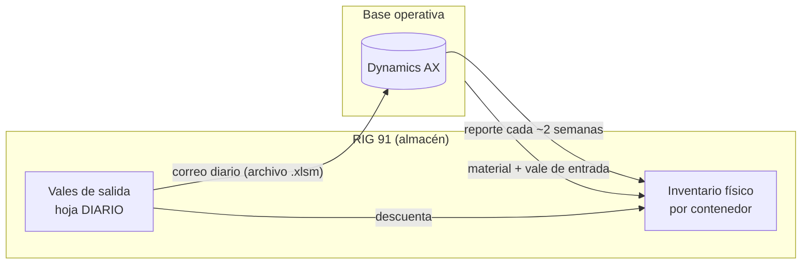

# 01 — Contexto y archivos fuente

> Análisis hecho el 29-sep-2026 sobre tres archivos de muestra que compartió el usuario. Las cifras de este documento describen esas muestras.

## Panorama

Hay tres archivos, cada uno con un papel distinto:

| Archivo | Papel | Quién lo edita |
|---|---|---|
| `DELTA RIG 91 <fecha>.xlsx` | Inventario **auditable** de AX (la referencia oficial) | Nadie en el RIG: lo genera la base operativa desde AX |
| `INVENTARIO DE REFACCIONAMIENTO DLTA DE ALMACEN <fecha>.xlsx` | Control **físico** por contenedor | Almacenista |
| `VALES DE SALIDA DLTA.xlsm` | Emisión de vales e historial (hoja `DIARIO`) | Almacenista |

**Analogía:** funciona como una conciliación bancaria.

- **AX** es el estado de cuenta del banco.
- **El inventario físico** es tu chequera.
- **Los vales** son los cheques que ya firmaste.

La diferencia entre AX y lo físico debe explicarse por los "cheques en tránsito": vales que ya ocurrieron pero que la base todavía no registra en AX.

---

## 1. Inventario AX — `DELTA RIG 91 <fecha>.xlsx`

- Es una exportación del reporte de Dynamics AX `rptInventSumDateTransForDimensions` (inventario por fecha con dimensiones). La hoja se llama `rptInventSumDateTransForDimensi`.
- El reporte original incluye **todos los almacenes**; el usuario filtra el suyo (`RIG91-IX25`). La herramienta debe aceptar tanto el reporte completo como el ya filtrado.
- La muestra tiene 244 renglones y 94 códigos, todos con Modelo de inventario `INV`.

| Col | Encabezado | Notas |
|---|---|---|
| A | Código de Artículo | Texto con ceros a la izquierda: `000000670` |
| B | Nombre del Artículo | |
| C | Modelo de Inventario | `INV` en la muestra (en el historial también aparece `CONPROV`) |
| D | Unidad de Medida | `PZA`, `KIT`, `JGO`, `m`… |
| E | Almacén | `RIG91-IX25` |
| F | Tamaño | **Dimensión 1. AX la corta a 10 caracteres** (`MARIPOSA12`, `0509-7901-`) |
| G | Color | Dimensión 2 (a veces marca, NP o medida secundaria) |
| H | Disponible | Cantidad |
| I | Valor Financiero | $ total del renglón |
| J | Valor de Inventario | $ total del renglón |

**Llave del artículo en AX:** `Código + Tamaño + Color`.

## 2. Inventario físico — `INVENTARIO DE REFACCIONAMIENTO…xlsx`

- 10 hojas visibles, una por contenedor y clase, más 1 hoja oculta con el catálogo:

| Hoja (nombre exacto, **incluye espacios finales**) | Tabla de Excel | Renglones |
|---|---|---|
| `CONTENEDOR #1 INVENTARIABLE` | `Tabla315` | 103 |
| `CONTENEDOR #1 CONSUMIBLE ` ← espacio final | `Tabla3155` | 86 |
| `CONTENEDOR #2 INVENTARIABLE` | `Tabla3158` | 31 |
| `CONTENEDOR #2 CONSUMIBLE` | `Tabla911347` | 19 |
| `CONTENEDOR #3 INVENTARIABLE` | `Tabla812` | 56 |
| `CONTENEDOR #3 CONSUMIBLE` | `Tabla8124` | 82 |
| `CONTENEDOR #4 INVENTARIABLE` | `Tabla911` | 22 |
| `CONTENEDOR #4 CONSUMIBLE` | `Tabla9113` | 71 |
| `CONTENEDOR #5 INVENTARIABLE` | `Tabla413` | 93 |
| `CONTENEDOR #5 CONSUMIBLE ` ← espacio final | `Tabla91134` | 46 |
| `ARTICULOS_MX` (oculta) | — | Catálogo de 1,345 códigos (1–1387) |

- Columnas de cada tabla (A–J):

| Col | Encabezado | Contenido |
|---|---|---|
| A | ITEM | Número consecutivo. Tiene huecos y repetidos; es solo visual |
| B | CODIGO AX | Número entero |
| C | `DESCRIPCIÓN ` (con espacio final) | Fórmula: `=IF(B2="","",VLOOKUP(Tabla[[#This Row],[CODIGO AX]],ARTICULOS_MX!$A$2:$B$5000,2,))` |
| D | DIMENSION | Texto libre: une lo que AX separa en Tamaño y Color |
| E | NP | Número de parte (opcional) |
| F | CANTIDAD | **Conteo físico** (dato base) |
| G | UM | Unidad de medida |
| H | CONSUMO | Salidas desde el conteo |
| I | INGRESO | Entradas desde el conteo |
| J | TOTAL | Fórmula: `=[@INGRESO]+[@CANTIDAD]-[@CONSUMO]` |

- Cada tabla termina con una fila **Total** (fila de totales de la tabla), con `SUBTOTAL(109,…)` en CANTIDAD, CONSUMO, INGRESO y TOTAL.
- CONSUMO e INGRESO están prácticamente vacíos: solo hay 1 consumo, que corresponde al vale 551. Hoy el archivo es una foto del conteo más algunos ajustes manuales.
- Un mismo artículo puede estar en varios contenedores. Por ejemplo, el INYECTOR 246-1854 tiene 4 en C1 y 3 en C3, que suman 7, igual que en AX.
- Tres hojas tienen notas de celda (comentarios) con pendientes de revisión.

## 3. Vales — `VALES DE SALIDA DLTA.xlsm`

### Estructura
- `DIARIO`: el historial. 1,294 renglones, folios 1–554, del 23-dic-2025 al 29-sep-2026.
- 11 hojas-formulario, una por área: `SOLDADOR`, `TOP DRIVE`, `ELECTRONICO`, `ELECTRICO`, `MECANICO ` (espacio final), `OPERACION DIA ` (espacio final), `OPERACION NOCHE`, `RIG MANAGER`, `CONTROL DE SOLIDOS`, `NOV`, `TRANSFERENCIAS`.
- Cada formulario trae el logo "MX DLTA NRG 1", botones de dibujo **GRABAR** (macro `PasarDatos`) y **LIMPIAR DATOS** (`LimpiarManual`), y copias propias del catálogo y de las listas desplegables. Por eso el archivo pesa 3.6 MB.

### Campos del formulario (área de impresión `C5:K62`)
| Celda | Campo |
|---|---|
| J6 | Fecha (`=TODAY()`) |
| K8 | No. folio (captura manual) |
| K10 | "Entradas": se marca `XXXXX` si el vale es de **entrada** |
| K11 | "Salida Planta": `XXXXX` si es de **salida** (una macro lo fuerza siempre) |
| E17 / I17 | Origen / Departamento origen |
| E18 / I18 | Destino / Departamento destino |
| Renglones 21–41 (21 renglones) | C = O.C., D = Cantidad, E = Código, F = Descripción (BUSCARV), I = Clave almacén (dimensión/NP), J = Presentación (UM), K = Lote (texto libre: NUEVO, equipo, serie…) |
| C43:C48 | Observaciones (textos fijos por área) |
| D52 / D53 | Entregó: nombre / puesto |
| I52 / I53 | Recibió: nombre / puesto |
| G58 | Autorizó (se usa en transferencias) |

### Cómo se guarda hoy
1. Se llena el formulario y se imprime.
2. **GRABAR** ejecuta `PasarDatos`, que copia como valores el bloque oculto `AX6:BO(6+TotalFilas-1)` al final de `DIARIO`. Cada fila del bloque es un renglón del vale con los datos del encabezado repetidos.
3. **LIMPIAR DATOS** borra K8, K10 y los renglones capturados.

### Columnas de `DIARIO` (A–T)
`FECHA | No. folio | Pase de Entrada | Pase de Salida | Origen: | Depto | Destino | Depto | OC | Cantidad | Código | Descripción | CLAVE | U.M. | C.U | Entrego/Recibio | Entrego/Recibio | Autorizo | FAMILIA | TRANSFERENCIA/CONSUMO`

- La columna **C.U** en realidad recibe el campo **LOTE** del formulario.
- **FAMILIA** (`INV` / `CONPROV`) y **TRANSFERENCIA/CONSUMO** se llenaron a mano en muy pocos renglones.

---

## 4. Problemas detectados

### Críticos (hoy se pierden datos)
1. **Renglones que no llegan a DIARIO.** El nombre definido `TotalFilas = COUNTIF(AX6:AX23,">0")` solo cuenta 18 de los 21 renglones del formulario. En `MECANICO ` cuenta 16 (`AX6:AX21`) y en `OPERACION DIA ` 17. El vale se imprime completo, pero los últimos renglones no se guardan y no hay ningún aviso.
2. **Un renglón sin O.C. no se guarda.** La columna BF del bloque depende de `C21` (O.C.). Por eso siempre se escribe `S/OC`; si se olvida, el renglón se pierde.

### Importantes
3. **Doble guardado:** 47 renglones están repetidos idénticos (vales guardados dos veces). Nada impide guardar el mismo folio otra vez.
4. **52 renglones con `#REF!`** (encabezados perdidos, un renglón completo perdido). **Falta el folio 494.**
5. **Tres catálogos que no coinciden:**
   - `ARTICULOS_MX` va del código 1 al 1387.
   - El catálogo del archivo de vales va del 1 al 1521.
   - `DIARIO` usa códigos que no están en ninguno (por ejemplo 1672, 3358, 2594), y el inventario usa el 1976.
6. Muchos nombres definidos del libro de vales apuntan a `#REF!` (restos de versiones anteriores).

### Menores (calidad de captura)
7. **Nombres con variantes:** 27 grupos de nombres escritos de distintas formas, por ejemplo con letras cambiadas o sin segundo apellido.
8. **Dimensiones distintas a AX** por errores de dedo: `1273001` vs `12732001`, `MLLU64HT` vs `MLLU640HT`, `63003 SKF` vs `6303 SKF`.
9. **Mismo NP con códigos distintos.** Por ejemplo, NP 1292182 aparece ×40 como CONTRA BÁSTAGO (762) y ×40 como ADAPTADORES (1387). Puede ser un doble conteo.
10. **Unidades escritas de varias formas:** `PZA` y `PZA ` (con espacio), `CUB` y `CUBETA`, `LITROS` y `LTS`.
11. **74 renglones con destino vacío** (`0`).

El detalle renglón por renglón se entregó al usuario fuera del repositorio en `Revision_historial_DLTA.xlsx`. Ver [07-migracion.md](07-migracion.md).

## 5. Primera prueba de conciliación (muestra)

- **Por renglón:** 183 de 244 renglones de AX (75%) coinciden exactamente con el físico solo con normalizar el texto (mayúsculas, sin espacios ni símbolos). El 25% restante requiere emparejamiento aproximado y una tabla de equivalencias que el usuario confirma una vez.
- **Por código:** 45 de 90 códigos cuadran.
- **Sin rastro físico:** 4 códigos de AX no aparecen en ningún contenedor: 776, 798, 824 y 896.
- **Fechas de corte:** AX es al 27-sep y el físico al 28-sep; hay vales del 27 al 29 de septiembre en medio. La conciliación debe considerar los vales en tránsito.
