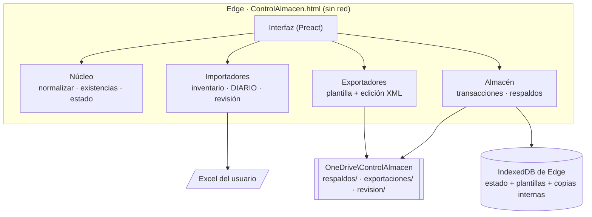

# 03 — Arquitectura

## Resumen

**Herramienta web que guarda todo en el equipo del usuario.** Es una sola página HTML autocontenida que corre completa
dentro de Microsoft Edge:

- **Sin instalar nada** (la PC del almacén bloquea instaladores, ver P-20 en [09](09-pendientes.md)).
- **Sin servidor y sin red:** la página no puede conectarse a ningún sitio (política de seguridad `connect-src 'none'`).
- **Datos:** en el almacenamiento local del navegador (IndexedDB) de este equipo y esta cuenta de Windows.
- **Respaldos y exportaciones:** archivos en la carpeta que elija el usuario (recomendado `OneDrive\ControlAlmacen`),
  con la API de acceso a archivos del navegador; si no hay carpeta, se descargan.
- **Excel:** exportación mediante **plantillas con edición XML mínima** (igual que antes, ahora en JavaScript).

**Analogía:** es una calculadora, no una oficina. La abres, trabaja con lo que le das y nada sale de tu escritorio; la
"libreta" (IndexedDB) está en el cajón de tu PC y las fotocopias (respaldos) en OneDrive.



## Tecnología elegida

| Capa | Elección | Por qué |
|---|---|---|
| Lenguaje | JavaScript (módulos ES), Node 22 para compilar y probar | Corre en cualquier navegador sin instalar nada |
| Interfaz | [Preact](https://preactjs.com) + [htm](https://github.com/developit/htm) | 5 KB, sin paso de JSX, MIT/Apache-2.0 |
| Decimales | [big.js](https://github.com/MikeMcl/big.js) | Cantidades exactas (nunca `float`), MIT |
| ZIP | [fflate](https://github.com/101arrowz/fflate) (solo deflate/inflate) + lector/escritor ZIP propio | Permite copiar las partes intactas **con sus bytes comprimidos originales** |
| Lectura de Excel | Lector propio por texto (`src/xlsx/leer.js`) | Rápido (el libro de vales real, 3.6 MB, se lee en ~0.4 s), sin DOM, probado contra openpyxl |
| Escritura de Excel | Edición de texto XML sobre la plantilla (`src/xlsx/plantilla.js`) y generador de libros nuevos (`src/xlsx/nuevo.js`) | Ver la sección siguiente |
| Datos | Un objeto JSON (el "estado") en IndexedDB | Simple, atómico, fácil de respaldar |
| Compilación | [esbuild](https://esbuild.github.io) → un solo HTML (~190 KB) | Un archivo que se abre con doble clic o se publica en un sitio estático |
| Pruebas | `node --test` con Excel sintéticos de `tests/fixtures/generar.py` | Estándar, sin dependencias extra |

**Alternativas descartadas**

| Opción | Motivo |
|---|---|
| Aplicación de escritorio (Python + instalador) | Seguridad de Windows la bloqueó ("Acción de riesgo bloqueada"). La versión de escritorio queda en el historial de git (commit `93fd82a`). |
| App web con servidor y base de datos en la nube | Los datos saldrían del equipo; requiere cuentas, hospedaje y costo |
| Excel/VBA mejorado | Frágil, difícil de probar y malo para emparejar texto |
| Python en el navegador (Pyodide) | ~10 MB de descarga y arranque lento para lo mismo |

## Decisión clave: exportar sobre plantilla, sin reescribir el libro

Guardar los libros del usuario con una biblioteca genérica (openpyxl, SheetJS, etc.) **no sirve** para exportar idéntico:

| Archivo | Qué se pierde al reescribir el libro |
|---|---|
| `VALES DE SALIDA DLTA.xlsm` | Todos los dibujos: logos, botones **GRABAR** / **LIMPIAR DATOS** con su macro asignada; metadatos de SharePoint (`customXml`); configuración de impresora |
| `INVENTARIO…xlsx` | Configuración de impresora; las notas cambian de formato; se reescriben estilos y cadenas compartidas |

**Solución:** el `.xlsx`/`.xlsm` es un ZIP de archivos XML. El exportador:

1. Toma como **plantilla el archivo real** del usuario (guardado en IndexedDB en la primera carga).
2. Copia **byte por byte** (incluso los bytes comprimidos) todas las partes del ZIP que no debe modificar.
3. En las partes que modifica, reemplaza **solo** los fragmentos de texto necesarios:
   - **Vales:** el contenido de `<sheetData>` de la hoja `DIARIO`, la `<dimension>`, el autofiltro, el panel inmovilizado y el nombre `_xlnm._FilterDatabase`.
   - **Inventario:** el `<sheetData>` de cada hoja de contenedor, el `ref` de cada tabla y su autofiltro, las áreas de impresión y filtros de `workbook.xml`, las notas (comentarios y VML) y la hoja `ARTICULOS_MX` si el catálogo creció.
4. Elimina `xl/calcChain.xml` (y su referencia) y marca `fullCalcOnLoad="1"`, para que Excel recalcule al abrir.
5. Las pruebas verifican que las partes no tocadas son idénticas a la plantilla y que la relectura da los datos esperados.

Es como corregir un formulario impreso con corrector solo en las casillas que cambian, en vez de volver a imprimirlo.

Verificación con los archivos reales (fuera del repositorio): la versión web produce el mismo contenido celda por celda
que la versión de escritorio (DIARIO de 1,294 renglones; 9,394 celdas del inventario con notas, tablas y nombres) y
LibreOffice recalcula las 1,258 fórmulas del inventario sin errores. Especificación: [06-formatos-excel.md](06-formatos-excel.md).

## Almacenamiento y respaldos

| Qué | Dónde |
|---|---|
| Programa | `ControlAlmacen.html`: un archivo que se abre en Edge (o la misma página publicada en un sitio estático). No se instala. |
| Datos de trabajo (estado) | IndexedDB de Edge, **una base por inventario**: `control-almacen` (DLTA, la de siempre) y `control-almacen-gsm` (GSM); almacén `estado`. Por equipo, por cuenta de Windows y por origen de la página (P-01: ambos almacenistas comparten cuenta y equipo). |
| Plantillas de Excel | IndexedDB, almacén `archivos` (bytes originales + SHA-256) |
| Copias internas | IndexedDB, almacén `instantaneas`: una al inicio de cada día y antes de restaurar (últimas 10) |
| Respaldos | `<carpeta elegida>\respaldos\almacen_AAAA-MM-DD_HHMMSS_<motivo>.zip` (GSM: `almacen_GSM_…`) |
| Exportaciones | `<carpeta elegida>\exportaciones\AAAA-MM-DD\` |
| Lista de revisión | `<carpeta elegida>\revision\` |

- Se pide al navegador **almacenamiento persistente** (`navigator.storage.persist()`), para que no borre los datos por falta de espacio.
- Riesgo principal: si alguien borra "cookies y datos de sitios" de Edge, se borran los datos. Por eso hay respaldo diario automático en OneDrive y la pantalla de inicio avisa si no hay respaldo del día.
- Edge pide confirmar el permiso de la carpeta una vez por sesión (un clic en el aviso superior).

**Respaldo (`.zip`):** `manifiesto.json` (versión, fecha, motivo, conteos), `estado.json` (todo el estado) y
`plantillas/` (los Excel del usuario). Momentos: primer uso del día, después de la primera carga, después de cada
exportación, antes de restaurar o borrar, y manual. Retención en la carpeta: último de cada uno de los últimos 30 días
y de los últimos 12 meses.

**Restauración:** valida el respaldo (formato, folios únicos, plantillas completas, **que sea del inventario abierto**),
guarda una copia interna del estado actual y reemplaza todo en una sola transacción de IndexedDB.

**Dos inventarios (Ronda 17):** DLTA y GSM usan el mismo formato de archivos pero van **por separado**: cada uno tiene su
base de IndexedDB (estado, plantillas, ajustes —carpeta, último respaldo— y copias internas), sus folios, respaldos y
conciliación. `src/nucleo/inventarios.js` los define (base, prefijo de respaldos, almacén de AX propuesto, palabras que
los identifican en un nombre de archivo). `main.js` abre el último usado (recordado en `localStorage` solo para el
arranque; si no se puede leer, DLTA) y cambia de uno a otro **en la misma pestaña** (sin recargar: crea otro `Almacen` y
otra `Sesion` y vuelve a dibujar la app con otra `key`). El candado de pestaña única es uno solo. `estado.config.inventario`
dice de cuál es cada estado: un respaldo de uno no se restaura en el otro, y la primera carga no acepta datos ajenos.

## Consistencia (el equivalente a las transacciones de SQLite)

- **Una sola pestaña a la vez:** candado del navegador (Web Locks). La segunda pestaña muestra un aviso y no carga. DLTA y GSM se cambian dentro de esa misma pestaña.
- **Cada cambio es atómico:** se aplica a una copia del estado; solo si se guardó bien en IndexedDB pasa a ser el estado vigente. Los cambios se atienden en fila, uno por uno.
- **Folios (F2):** se asignan dentro de ese mismo mecanismo (candado + cambio atómico): siempre el último + 1, validando que no exista para su tipo. Todos se usan: no se reutilizan, no se borran, no se cancelan ni se saltan; un vale equivocado se corrige con motivo y bitácora.

## Usuarios y turnos

- Sin contraseñas (misma PC y misma confianza). Se elige el **almacenista en turno** arriba a la derecha; queda en cada movimiento y en la bitácora (`auditoria`).

## Estructura del proyecto

```
Control-almacen/
├── package.json · scripts/build.mjs      # compilación a dist/ControlAlmacen.html
├── README.md · CLAUDE.md · docs/
├── src/
│   ├── index.html · estilos.css · main.js  # página, estilos y arranque (candado, IndexedDB)
│   ├── nucleo/            # reglas de negocio puras: normalizar, decimal, fechas, difflib,
│   │                      #   catálogo, estado (modelo de datos), existencias
│   ├── xlsx/              # zip, xml, lector, estilos (colores, bordes, formatos), libros nuevos,
│   │                      #   edición de plantilla
│   ├── importadores/      # inventario físico, libro de vales (DIARIO, formularios, catálogo)
│   ├── servicios/         # limpieza, lista de revisión, primera carga, consultas, vales
│   │                      #   (borradores, folio, corregir con resumen de cambios, envíos), catálogos, sincronizar
│   ├── impresion/         # hoja-formulario → HTML tamaño carta para imprimir el vale
│   ├── exportadores/      # vales (.xlsm) e inventario (.xlsx) sobre plantilla
│   ├── almacen/           # IndexedDB, transacciones, respaldos, carpeta/descargas
│   └── ui/                # interfaz: marco, componentes y una página por módulo
├── tests/
│   ├── fixtures/generar.py  # genera Excel SINTÉTICOS (necesita Python + openpyxl)
│   ├── ayuda.js
│   └── *.test.js
└── herramientas/diagnostico-navegador.html
```

## Reglas de diseño

1. **El núcleo no conoce la interfaz ni el navegador:** `nucleo/`, `xlsx/`, `importadores/`, `servicios/`, `impresion/` y `exportadores/` se prueban en Node sin navegador.
2. **Las existencias se calculan a partir de los movimientos**, no se guardan como un número suelto: `CONSUMO` y `INGRESO` son la suma de vales emitidos con folio posterior al corte del conteo.
3. **Nada emitido se elimina ni se cancela:** se corrige con motivo (el motivo se llena solo con lo que cambió).
4. **Fechas** como texto ISO en el estado; hacia Excel, número de serie con el estilo de la plantilla.
5. **Cantidades** como texto decimal en el estado y `Big` en los cálculos; nunca `float`.

## Impresión del vale (F2)

El vale no se imprime con un diseño propio: se **dibuja la hoja-formulario del libro de vales del usuario** (la
plantilla registrada en la primera carga) como una tabla HTML y se llenan sus campos.

- `impresion/formulario.js` lee de la hoja: área de impresión, anchos de columna y altos de fila (con las mismas
  fórmulas de conversión que Excel), celdas combinadas, estilos (`xlsx/estilos.js`: fuentes, rellenos con colores de
  tema y tinte, bordes, alineación, formatos de número y fecha en español), imágenes del dibujo (el logo; los botones
  de macro se omiten), encabezado/pie de página, márgenes, orientación y escala guardada por "ajustar a 1 página".
- Los campos se ubican **por sus etiquetas** (Fecha, No. folio, Salida, Origen/Destino, encabezado de renglones,
  Nombre/Puesto, AUTORIZA, observaciones), así que cada hoja puede tener su propia capacidad y el orden de firmas
  (NOV firma al revés).
- `impresion/vale.js` genera páginas carta (`@page`) con `print-color-adjust: exact` para conservar los rellenos. La
  tabla lleva un margen de 3 px dentro del lienzo para que el marco exterior (bordes colapsados) no se recorte, y el
  borde derecho del marco replica el izquierdo donde la hoja no lo trae.
- **Fotos de los vales (NOV):** las imágenes de la hoja-formulario que están sobre la zona de partidas se toman
  como espacios para fotos (posición y tamaño); las del ejemplo no se imprimen y las partidas caben solo arriba de ellas.
  Las fotos del vale se reducen a 1280 px (JPEG) al elegirlas, se guardan en IndexedDB con clave por contenido
  (`fotos/<sha256>.jpg`, sin duplicados) y viajan dentro de los respaldos (`fotos/` en el .zip). Las que ningún vale ni
  borrador usa se borran al abrir la herramienta.
- **Listas desplegables:** no se usan `<select>` ni `<datalist>` (su lista la dibuja el navegador y no se puede
  estilizar); todas son componentes propios (`Lista`, `Combo`, `CampoSugerido`) con el mismo aspecto y teclado.
- Los Excel exportados se guardan con la ventana "Guardar como" del navegador (`showSaveFilePicker`, recuerda la última
  carpeta); si el navegador no la tiene, en la carpeta elegida o en Descargas. La
  interfaz las inserta en `#area-impresion` y llama `window.print()`; Edge ofrece imprimir o *Guardar como PDF*. No se
  usa ninguna biblioteca de PDF ni conexión de red.
