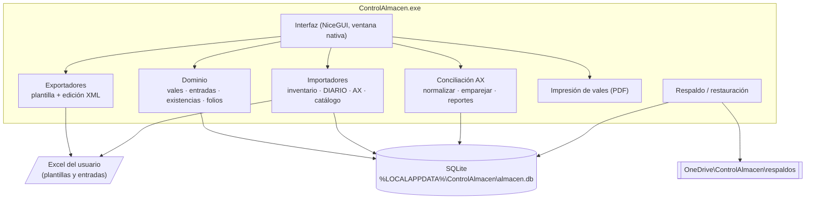

# 03 — Arquitectura

## Resumen

Aplicación de escritorio en **Python**:

- **Interfaz:** NiceGUI dentro de una ventana nativa de Windows (WebView2).
- **Datos:** base de datos local **SQLite**.
- **Respaldos:** copias automáticas a **OneDrive**.
- **Excel:** exportación mediante **plantillas con edición XML mínima**.
- **Distribución:** instalador `.exe`.



## Tecnología elegida

| Capa | Elección | Por qué |
|---|---|---|
| Lenguaje | Python 3.12 | Las mejores bibliotecas para Excel y para emparejar texto; fácil de mantener |
| Interfaz | [NiceGUI](https://nicegui.io) en modo nativo (pywebview + WebView2, que ya viene en Windows 10/11) | Tablas con filtro, formularios y pestañas con poco código. Parece app de escritorio y no abre navegador. Licencia MIT. |
| Base de datos | SQLite (un solo archivo) | Sin servidor, confiable, fácil de respaldar |
| Acceso a datos | SQLAlchemy 2 + Alembic | Modelo claro y migraciones versionadas para cambiar el esquema sin perder datos |
| Lectura de Excel | openpyxl (+ pandas donde convenga) | Lee valores, fórmulas, tablas y notas |
| Escritura de Excel | `zipfile` + `lxml`: **edición XML mínima sobre plantilla** | Ver la sección siguiente: es la única forma de exportar idéntico |
| Emparejamiento aproximado | rapidfuzz | Rápido, MIT, sin dependencias pesadas |
| PDF del vale | fpdf2 | Python puro y ligero. Se abre en el visor predeterminado para imprimir. |
| Empaquetado | PyInstaller (modo carpeta) + Inno Setup | Instalador `.exe` estándar, ambos libres |
| Pruebas | pytest | Estándar |

**Alternativas descartadas**

| Opción | Motivo |
|---|---|
| Excel/VBA mejorado | Es frágil (los errores actuales son típicos de este esquema), difícil de probar y malo para emparejar texto |
| App web en servidor | Innecesaria para 1 PC y agrega dependencia de red |
| Electron/.NET | Más pesados o con peor soporte para conservar macros al editar Excel |

## Decisión clave: exportar sobre plantilla, sin reescribir el libro

Se probó abrir y guardar ambos archivos con openpyxl (la biblioteca estándar). El resultado **no sirve** para exportar idéntico:

| Archivo | Qué se pierde al guardar con openpyxl |
|---|---|
| `VALES DE SALIDA DLTA.xlsm` | Todos los dibujos: logos, botones **GRABAR** / **LIMPIAR DATOS** con su macro asignada; metadatos de SharePoint (`customXml`); configuración de impresora |
| `INVENTARIO…xlsx` | Configuración de impresora; las notas se convierten a otro formato; se reescriben estilos y cadenas compartidas |

**Solución:** el `.xlsx`/`.xlsm` es un ZIP de archivos XML. El exportador:

1. Toma como **plantilla el último archivo real** del usuario (registrado en la herramienta).
2. Copia **byte por byte** todas las partes del ZIP, excepto las que debe modificar.
3. En las partes que modifica, reemplaza **solo** lo necesario:
   - **Vales:** la sección `<sheetData>` de la hoja `DIARIO`, la referencia `<dimension>` y el rango del autofiltro.
   - **Inventario:** el `<sheetData>` de cada hoja de contenedor, el `ref` de cada tabla (`xl/tables/tableN.xml`) y las áreas de impresión y filtros de `workbook.xml`. También la hoja `ARTICULOS_MX` si el catálogo creció.
4. Elimina `xl/calcChain.xml` (y su referencia) y marca `fullCalcOnLoad="1"`, para que Excel recalcule las fórmulas al abrir.
5. Valida el resultado: el ZIP es válido, el XML está bien formado, las partes no tocadas son idénticas a la plantilla y la relectura con openpyxl da los datos esperados.

Es como corregir un formulario impreso con corrector solo en las casillas que cambian, en vez de volver a imprimir todo el formulario.

Especificación detallada: [06-formatos-excel.md](06-formatos-excel.md).

## Almacenamiento y respaldos

**Principio:** la base de datos viva **no** está dentro de la carpeta de OneDrive. OneDrive sincroniza archivos mientras se escriben y eso puede corromper una base SQLite abierta. En su lugar, se guardan **copias consistentes** en OneDrive.

**Analogía:** la base viva es la libreta que tienes en el escritorio; OneDrive es la caja fuerte donde guardas una fotocopia cada día.

| Qué | Dónde |
|---|---|
| Base de datos viva | `%LOCALAPPDATA%\ControlAlmacen\almacen.db`. Ambos almacenistas usan la misma cuenta de Windows (P-01), así que la carpeta local del usuario basta y la instalación no requiere administrador. |
| Plantillas de Excel registradas | `%LOCALAPPDATA%\ControlAlmacen\plantillas\` |
| Registros (logs) | `%LOCALAPPDATA%\ControlAlmacen\logs\`, rotativos |
| Programa | `%LOCALAPPDATA%\Programs\ControlAlmacen\` (instalador por usuario, sin administrador) |
| Respaldos | `%OneDrive%\ControlAlmacen\respaldos\` (se detecta también `%OneDriveCommercial%`) |
| Exportaciones | Carpeta que elija el usuario; por defecto `%OneDrive%\ControlAlmacen\exportaciones\` |

**Respaldo:**
- Se hace con la API de *backup* de SQLite (copia consistente aunque la base esté abierta) y se comprime en `.zip` junto con las plantillas.
- Momentos: al cerrar, al primer uso del día, y antes de cada importación, migración o restauración.
- Retención: los últimos 30 diarios y 12 mensuales (configurable).
- Nombre: `almacen_AAAA-MM-DD_HHMM.zip`.

**Restauración:**
- Se hace desde un asistente.
- Primero respalda el estado actual, luego reemplaza la base y verifica su integridad (`PRAGMA integrity_check`).
- En una instalación nueva, la herramienta detecta respaldos en OneDrive y ofrece restaurar el más reciente.

## Usuarios y turnos

- Sin contraseñas (misma PC y misma confianza). Al abrir se elige el **almacenista en turno**, que queda en cada movimiento y en la bitácora.
- En el cambio de guardia, el que sale puede generar un **resumen de guardia**: vales emitidos, entradas, pendientes de envío y alertas.

## Estructura del proyecto (se crea en la Fase 1)

```
Control-almacen/
├── pyproject.toml
├── README.md · CLAUDE.md · docs/
├── src/control_almacen/
│   ├── app.py                  # arranque (NiceGUI modo nativo)
│   ├── config.py               # rutas, almacén AX, parámetros
│   ├── db/
│   │   ├── modelos.py          # tablas (SQLAlchemy)
│   │   ├── sesion.py
│   │   └── migraciones/        # Alembic
│   ├── dominio/                # reglas de negocio, sin interfaz
│   │   ├── catalogo.py
│   │   ├── existencias.py      # cálculo CANTIDAD/CONSUMO/INGRESO/TOTAL
│   │   ├── folios.py           # asignación atómica de folios
│   │   ├── vales_salida.py
│   │   ├── vales_entrada.py
│   │   ├── conteos.py
│   │   └── normalizar.py       # texto, dimensiones, UM, nombres
│   ├── importadores/
│   │   ├── inventario_fisico.py
│   │   ├── diario_vales.py     # con reglas de limpieza
│   │   ├── reporte_ax.py
│   │   └── catalogo.py
│   ├── exportadores/
│   │   ├── plantilla_ooxml.py  # edición XML mínima (núcleo común)
│   │   ├── inventario.py
│   │   ├── vales.py
│   │   ├── entradas.py
│   │   └── ajuste_ax.py
│   ├── conciliacion/
│   │   ├── emparejar.py
│   │   └── reportes.py
│   ├── impresion/vale_pdf.py
│   ├── respaldo/respaldo.py
│   └── ui/                     # una página por módulo
├── tests/
│   ├── fixtures/               # Excel ANONIMIZADOS (sí se versionan)
│   └── …
└── packaging/
    ├── control_almacen.spec    # PyInstaller
    └── instalador.iss          # Inno Setup
```

## Reglas de diseño

1. **El dominio no conoce la interfaz ni Excel:** se puede probar solo con pytest.
2. **Las existencias se calculan a partir de los movimientos, no se guardan como un número suelto.** `CONSUMO` = suma de salidas desde el último conteo de esa ubicación, e `INGRESO` = suma de entradas desde ese conteo. Así un número nunca se "desincroniza" de su historial.
3. **El folio se asigna dentro de una transacción** (`BEGIN IMMEDIATE`), con restricción `UNIQUE` en la base de datos.
4. **Borrado lógico:** nada emitido se elimina; se cancela o se corrige con motivo.
5. **Fechas** en ISO dentro de la base. Hacia Excel se escriben como número de serie con el mismo estilo de la plantilla.
