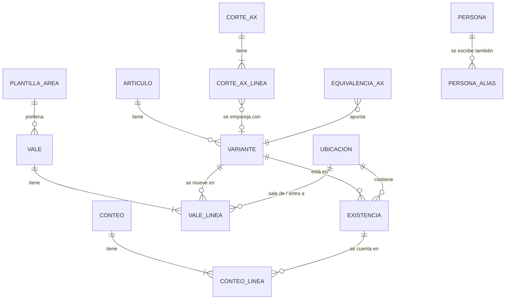

# 04 — Modelo de datos

## Conceptos

| Concepto | Qué es | Ejemplo |
|---|---|---|
| **Artículo** | Un código AX | `712 BALEROS` |
| **Variante** | Artículo + dimensión (+ NP) + UM. Es lo que se cuenta y se mueve. | `712 BALEROS · 6309-2Z/C3 · PZA` |
| **Ubicación** | Una hoja del inventario actual (contenedor + clase) | `CONTENEDOR #5 INVENTARIABLE` |
| **Existencia** | Una variante en una ubicación. Equivale a **un renglón del Excel de inventario**. | Baleros 6309-2Z/C3 en C5-INV |
| **Vale** | Documento de salida o entrada, con folio | Salida 555 |
| **Conteo** | Foto física que fija `CANTIDAD` y reinicia CONSUMO/INGRESO | Conteo del 28-sep-2026 |
| **Corte AX** | Un reporte de AX importado | AX al 27-sep-2026 |



## Tablas

### Catálogos

**`articulo`**
| Campo | Tipo | Notas |
|---|---|---|
| codigo | int PK | Código AX sin ceros a la izquierda |
| descripcion | texto | Descripción oficial |
| clase | `INV` / `CONS` / nulo | Inventariable o consumible (lista pendiente de la base) |
| modelo_ax | texto | `INV`, `CONPROV`… si se conoce |
| activo | bool | |

**`variante`**
| Campo | Tipo | Notas |
|---|---|---|
| id | PK | |
| codigo | FK articulo | |
| dimension | texto | Como se muestra y exporta (columna DIMENSION / CLAVE) |
| np | texto | Número de parte (columna NP) |
| um | texto | Unidad normalizada |
| dimension_clave, np_clave | texto | Normalización estricta (ver reglas abajo) |
| activo | bool | |
| | | `UNIQUE(codigo, dimension_clave, np_clave)` |

**`ubicacion`**
| Campo | Tipo | Notas |
|---|---|---|
| id | PK | |
| contenedor | int | 1–5 |
| clase | `INV` / `CONS` | |
| hoja_excel | texto | Nombre exacto, **con espacios finales** si los tiene |
| tabla_excel | texto | `Tabla315`, etc. |
| orden | int | Orden de las hojas |

**`existencia`** (un renglón del Excel de inventario)
| Campo | Tipo | Notas |
|---|---|---|
| id | PK | |
| variante_id | FK | |
| ubicacion_id | FK | Sin restricción única: el inventario real tiene la misma variante repetida en una hoja (se señala en la revisión) |
| orden | int | Posición en la hoja. **Estable:** los renglones nuevos van al final. |
| item | int nulo | Valor de la columna ITEM |
| cantidad_conteo | decimal | La `CANTIDAD` del Excel |
| conteo_id | FK | Conteo que fijó esa cantidad |
| nota | texto | Nota de celda del Excel, si la hay |
| fila_origen | int | Fila del Excel importado (para conservar estilos y notas al exportar) |
| dimension_hoja, np_hoja, um_hoja | texto | Escritura exacta del renglón cuando difiere de la variante ("0-5,000PSI" vs "0-5000PSI"): se exporta tal cual |
| activo | bool | En 0 no se borra: el renglón sigue en el Excel con 0, como hoy |

**`persona`** (id, nombre, puesto, área, es_almacenista, activo) y **`persona_alias`** (alias → persona_id): unifican las variantes de nombre del historial.

**`departamento`**, **`destino`**: listas simples.

**`plantilla_area`**: sustituye las 11 hojas-formulario.
| Campo | Notas |
|---|---|
| nombre | SOLDADOR, TOP DRIVE, … |
| origen, depto_origen, destino, depto_destino | Valores por defecto |
| recibe_persona_id, recibe_puesto | Receptor habitual |
| requiere_autoriza | Transferencias: sí |
| naturaleza | `CONSUMO` / `TRANSFERENCIA` |
| observaciones | Las 3 líneas fijas (C44:C46) |

### Movimientos

**`vale`**
| Campo | Tipo | Notas |
|---|---|---|
| id | PK | |
| tipo | `SALIDA` / `ENTRADA` | |
| folio | int nulo | Nulo mientras es borrador. `UNIQUE(tipo, folio)`. |
| folio_externo | texto | Entradas: folio del vale de la base |
| estado | `BORRADOR` / `EMITIDO` / `CANCELADO` | |
| fecha | fecha | |
| origen, depto_origen, destino, depto_destino | texto | Copia al momento de emitir |
| entrego_nombre, entrego_puesto, recibio_nombre, recibio_puesto, autorizo_nombre | texto | Copia (el historial no cambia si luego se edita la persona) |
| entrego_id, recibio_id, autorizo_id | FK persona nulas | |
| observaciones | texto | |
| plantilla_area_id | FK | |
| naturaleza | `CONSUMO` / `TRANSFERENCIA` | Para la columna TRANSFERENCIA/CONSUMO |
| creado_por, creado_en, emitido_en | | |
| cancelado_en, motivo_cancelacion | | |
| ruta_escaneo | texto | Enlace o ruta del PDF escaneado (opcional) |
| migrado, fila_diario_origen | | Trazabilidad de la migración |

**`vale_linea`**
| Campo | Tipo | Notas |
|---|---|---|
| id | PK | |
| vale_id | FK | |
| renglon | int | 1–21 |
| oc | texto | En blanco se exporta como `S/OC` |
| cantidad | decimal > 0 | |
| codigo | int | Copia |
| descripcion | texto | Copia |
| clave | texto | Lo que va a la columna CLAVE (dimensión / NP) |
| um | texto | |
| lote | texto | Columna LOTE → "C.U" en DIARIO |
| existencia_id | FK nulo | **Renglón del inventario** de donde sale o a donde entra (resuelve el caso de variantes repetidas) |
| variante_id | FK nulo | Copia de la variante de esa existencia |
| no_inventariado | bool | Diésel, gases, servicios o artículos sin existencia: no descuentan |
| familia, transferencia_consumo | texto | Columnas S y T del DIARIO |
| encabezado_original | JSON | Migración: encabezado del renglón cuando difería del del vale (se exporta tal cual) |

**`conteo`** (id, fecha, alcance: total o lista de ubicaciones, usuario, notas, `ultimo_folio_salida`, `ultimo_folio_entrada`) y **`conteo_linea`** (conteo_id, existencia_id, cantidad_contada, cantidad_teorica_previa).

### Conciliación

| Tabla | Campos |
|---|---|
| **`corte_ax`** | fecha_corte, almacen, archivo, hash, importado_en, folio_corte (opcional) |
| **`corte_ax_linea`** | corte_id, las 10 columnas del reporte, variante_id resuelta, método (`exacto` / `equivalencia` / `aproximado` / `manual` / `sin_pareja`), puntaje |
| **`equivalencia_ax`** | (codigo, tamano, color) → variante_id, confirmado_por, fecha. **Memoria de emparejamientos.** |

### Operación

| Tabla | Campos |
|---|---|
| **`plantilla_excel`** | tipo (`INVENTARIO` / `VALES`), ruta, hash, fecha, activa |
| **`exportacion`** | tipo, fecha, archivo, hash, usuario, último folio incluido, marcada como enviada |
| **`auditoria`** | fecha_hora, usuario, entidad, entidad_id, acción, antes (JSON), después (JSON), motivo |
| **`config`** | clave / valor (almacén AX, rutas, retención de respaldos…) |

## Cálculo de existencias

Para cada renglón `existencia` (variante `v` en ubicación `u`), con su último conteo `c`:

```
CANTIDAD = existencia.cantidad_conteo
CONSUMO  = Σ cantidad de vale_linea  (vale SALIDA, EMITIDO, variante v, ubicación u, folio > c.ultimo_folio_salida)
INGRESO  = Σ cantidad de vale_linea  (vale ENTRADA, EMITIDO, variante v, ubicación u, folio > c.ultimo_folio_entrada)
TOTAL    = CANTIDAD + INGRESO − CONSUMO      ← en el Excel sigue siendo fórmula
```

El corte se hace **por folio, no por fecha**. Así no hay ambigüedad cuando un vale y un conteo ocurren el mismo día.

## Reglas de normalización

| Regla | Detalle |
|---|---|
| Código AX | `000000670` → `670` |
| Texto general | Mayúsculas, sin espacios al inicio o al final, espacios múltiples → uno, comillas tipográficas (`” ″ ''`) → `"` |
| `*_clave` (estricta) | Texto general + quitar espacios, guiones y puntos. **Conserva `/` y `"`** para no confundir `1/2"` con `12`. Se usa para unicidad. |
| Clave laxa | Solo `A-Z0-9`. Se usa **solo para sugerir** parejas, nunca para fusionar automáticamente. |
| Truncado de AX | `Tamaño` de AX = primeros 10 caracteres. Si la dimensión física empieza con el Tamaño de AX, es candidata. |
| Tamaño + Color | Para comparar con DIMENSION física se prueban `Tamaño`, `Tamaño + " " + Color` y `Color` dentro de NP. |
| UM | Tabla de equivalencias: `PZA␠` / `pza` / `PZ A` → `PZA`, `CUB` → `CUBETA`, `LITROS` → `LTS`, `M` → `MTS`… |
| Nombres | Tabla `persona_alias`, confirmada por el usuario en la migración |
