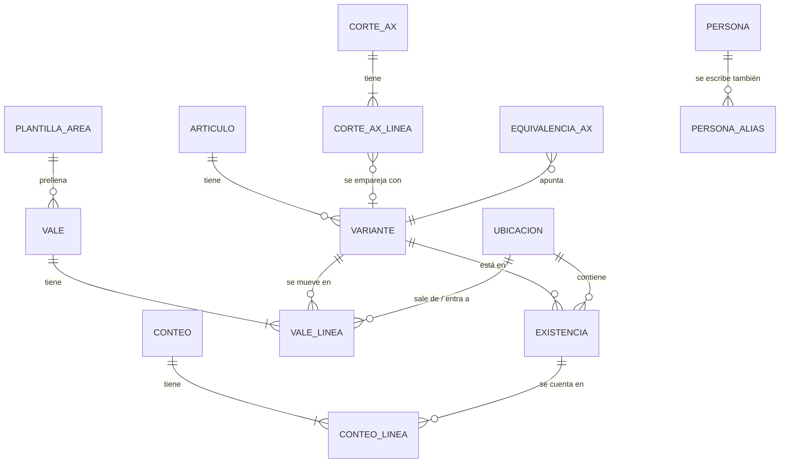

# 04 — Modelo de datos

## Conceptos

| Concepto | Qué es | Ejemplo |
|---|---|---|
| **Artículo** | Un código AX | `712 BALEROS` |
| **Variante** | Artículo + dimensión (+ NP) + UM. Es lo que se cuenta y se mueve. | `712 BALEROS · 6309-2Z/C3 · PZA` |
| **Ubicación** | Una hoja del inventario actual (contenedor + clase) | `CONTENEDOR #5 INVENTARIABLE` |
| **Existencia** | Una variante en una ubicación. Equivale a **un renglón del Excel de inventario**. | Baleros 6309-2Z/C3 en C5-INV |
| **Vale** | Documento de salida o entrada, con folio | Salida 555 |
| **Conteo** | Foto física que fija `CANTIDAD` y reinicia CONSUMO/INGRESO | Conteo del 28-sep-2026 |
| **Corte AX** | Un reporte de AX importado | AX al 27-sep-2026 |



## Tablas

### Catálogos

**`articulo`**
| Campo | Tipo | Notas |
|---|---|---|
| codigo | int PK | Código AX sin ceros a la izquierda |
| descripcion | texto | Descripción oficial |
| clase | `INV` / `CONS` / nulo | Inventariable o consumible (lista pendiente de la base) |
| modelo_ax | texto | `INV`, `CONPROV`… si se conoce |
| activo | bool | |

**`variante`**
| Campo | Tipo | Notas |
|---|---|---|
| id | PK | |
| codigo | FK articulo | |
| dimension | texto | Como se muestra y exporta (columna DIMENSION / CLAVE) |
| np | texto | Número de parte (columna NP) |
| um | texto | Unidad normalizada |
| dimension_clave, np_clave | texto | Normalización estricta (ver reglas abajo) |
| activo | bool | |
| | | `UNIQUE(codigo, dimension_clave, np_clave)` |

**`ubicacion`**
| Campo | Tipo | Notas |
|---|---|---|
| id | PK | |
| contenedor | int | 1–5 |
| clase | `INV` / `CONS` | |
| hoja_excel | texto | Nombre exacto, **con espacios finales** si los tiene |
| tabla_excel | texto | `Tabla315`, etc. |
| orden | int | Orden de las hojas |

**`existencia`** (un renglón del Excel de inventario)
| Campo | Tipo | Notas |
|---|---|---|
| id | PK | |
| variante_id | FK | |
| ubicacion_id | FK | Sin restricción única: el inventario real tiene la misma variante repetida en una hoja (se señala en la revisión) |
| orden | int | Posición en la hoja. **Estable:** los renglones nuevos van al final. |
| item | int nulo | Valor de la columna ITEM |
| cantidad_conteo | decimal | La `CANTIDAD` del Excel |
| conteo_id | FK | Conteo que fijó esa cantidad |
| nota | texto | Nota de celda del Excel, si la hay |
| fila_origen | int | Fila del Excel importado (para conservar estilos y notas al exportar) |
| dimension_hoja, np_hoja, um_hoja | texto | Escritura exacta del renglón cuando difiere de la variante ("0-5,000PSI" vs "0-5000PSI"): se exporta tal cual |
| activo | bool | En 0 no se borra: el renglón sigue en el Excel con 0, como hoy |

**`persona`** (id, nombre, puesto, área, es_almacenista, activo) y **`persona_alias`** (alias → persona_id): unifican las variantes de nombre del historial.

**`departamento`**, **`destino`**: listas simples.

**`plantilla_area`**: sustituye las 11 hojas-formulario (pantalla *Áreas y personas*).
| Campo | Notas |
|---|---|
| nombre | SOLDADOR, TOP DRIVE, … |
| tipo | `INTERNO` (departamento del equipo), `EXTERNO` (otra compañía, p. ej. NOV) o `TRANSFERENCIA` (a otro equipo). Si falta, se deduce: transferencia por nombre/naturaleza; externa si el destino es distinto del origen |
| hoja_excel | Hoja-formulario del libro de vales con la que se **imprime** el vale (nula = la del departamento) |
| origen, depto_origen, destino, depto_destino | Valores por defecto. En las **internas** son fijos: `RIG 91 · ALMACEN` → `RIG 91 · <depto del área>` |
| recibe_nombre, recibe_puesto | Receptor habitual |
| autoriza_nombre | Quién autoriza habitualmente (transferencias) |
| requiere_autoriza | Transferencias: sí (P-14) |
| naturaleza | `CONSUMO` / `TRANSFERENCIA` |
| observaciones | Las líneas fijas del formato (C44:C46). En las internas solo cambia, en cada vale, la línea `ETAPA DE PERFORACION: …` |
| lote_defecto | Se copia a la columna LOTE de cada renglón nuevo |
| autoriza_puesto | Puesto de quien autoriza (TRANSFERENCIAS: G59) |
| firmas_extra | `{izq, der}` con título, nombre y puesto de la segunda fila de firmas (NOV), o nulo |
| almacenista_derecha | El almacenista firma a la derecha (NOV) |
| activo | Las inactivas no se ofrecen al hacer vales |

### Movimientos

**`vale`**
| Campo | Tipo | Notas |
|---|---|---|
| id | PK | |
| tipo | `SALIDA` / `ENTRADA` | |
| folio | int | Se asigna al emitir (los borradores viven aparte, en `borradores`). `UNIQUE(tipo, folio)`. |
| folio_externo | texto | Entradas: folio del vale de la base |
| estado | `EMITIDO` (o `CANCELADO` en vales de versiones anteriores: ya no se cancela) | |
| fecha | fecha | |
| origen, depto_origen, destino, depto_destino | texto | Copia al momento de emitir |
| entrego_nombre, entrego_puesto, recibio_nombre, recibio_puesto, autorizo_nombre, autorizo_puesto | texto | Copia (el historial no cambia si luego se edita la persona). En los **migrados** de áreas con el almacenista a la derecha (NOV) vienen **por posición**, como los guardaba la macro: entregó = quien firma a la izquierda |
| firma_extra_izq_nombre/puesto, firma_extra_der_nombre/puesto | texto | Segunda fila de firmas del formato (NOV: personal de la compañía a la izquierda, patrimonial a la derecha) |
| fotos | lista de claves | Una por espacio de foto del formato (`null` = vacío); el archivo está en IndexedDB y en los respaldos |
| almacenista_derecha | bool | El área firma con el almacenista a la derecha: al exportar, P = izquierda y Q = derecha, como la macro |
| entrego_id, recibio_id, autorizo_id | FK persona nulas | |
| observaciones | texto | |
| plantilla_area_id | FK | |
| naturaleza | `CONSUMO` / `TRANSFERENCIA` | Para la columna TRANSFERENCIA/CONSUMO |
| creado_por, creado_en, emitido_en, modificado_en | | |
| cancelado_en, motivo_cancelacion | | Solo en vales cancelados con versiones anteriores |
| cambio | int | Contador global que sube en cada emisión o corrección; decide qué hay **por enviar** |
| enviado_en | fecha-hora nula | Primera vez que se marcó como enviado a la base |
| ruta_escaneo | texto | Enlace o ruta del PDF escaneado (opcional) |
| migrado, fila_diario_origen | | Trazabilidad de la migración |

**`vale_linea`**
| Campo | Tipo | Notas |
|---|---|---|
| id | PK | |
| vale_id | FK | |
| renglon | int | 1–21 (la capacidad real es la del formato impreso: 19–21 según la hoja) |
| oc | texto | En blanco se exporta como `S/OC` |
| cantidad | decimal > 0 | |
| codigo | int | Copia |
| descripcion | texto | Copia |
| clave | texto | Lo que va a la columna CLAVE (dimensión / NP) |
| um | texto | |
| lote | texto | Columna LOTE → "C.U" en DIARIO |
| existencia_id | FK nulo | **Renglón del inventario** de donde sale o a donde entra (resuelve el caso de variantes repetidas) |
| variante_id | FK nulo | Copia de la variante de esa existencia |
| no_inventariado | bool | Diésel, gases, servicios o artículos sin existencia: no descuentan |
| familia, transferencia_consumo | texto | Columnas S y T del DIARIO (vacías en vales nuevos, como en los recientes del Excel, P-13) |
| justificacion | texto | Obligatoria si la cantidad supera la existencia del renglón elegido |
| encabezado_original | JSON | Migración: encabezado del renglón cuando difería del del vale (se exporta tal cual) |

**`conteo`** (id, fecha, alcance: total o lista de ubicaciones, usuario, notas, `ultimo_folio_salida`, `ultimo_folio_entrada`) y **`conteo_linea`** (conteo_id, existencia_id, cantidad_contada, cantidad_teorica_previa).

**`borrador`** (lista `borradores` del estado): vales en captura, uno por pestaña. Mismos campos de encabezado y
renglones que `vale`, sin folio. Se guardan solos mientras se escribe y **no consumen folio**; al emitir se validan,
reciben folio dentro de un cambio atómico y pasan a `vales`. Descartar un borrador no deja huella en los folios.

**`envio`** (lista `envios`): cada vez que el almacenista marca "ya lo envié a la base".
| Campo | Notas |
|---|---|
| fecha_hora, usuario | |
| hasta_cambio | Valor del contador `cambio` al marcar: lo que tenga `cambio` mayor está **por enviar** (nuevo o corregido) |
| ultimo_folio, folios | Para la bitácora |

### Conciliación

| Tabla | Campos |
|---|---|
| **`corte_ax`** | fecha_corte, almacen, archivo, hash, importado_en, folio_corte (opcional) |
| **`corte_ax_linea`** | corte_id, las 10 columnas del reporte, variante_id resuelta, método (`exacto` / `equivalencia` / `aproximado` / `manual` / `sin_pareja`), puntaje |
| **`equivalencia_ax`** | (codigo, tamano, color) → variante_id, confirmado_por, fecha. **Memoria de emparejamientos.** |

### Operación

| Tabla | Campos |
|---|---|
| **`plantilla_excel`** | tipo (`INVENTARIO` / `VALES`), ruta, hash, fecha, activa |
| **`exportacion`** | tipo, fecha, archivo, hash, usuario, último folio incluido, marcada como enviada |
| **`auditoria`** | fecha_hora, usuario, entidad, entidad_id, acción, antes (JSON), después (JSON), motivo |
| **`config`** | clave / valor (almacén AX, retención de respaldos, almacenista en turno, `etapa_perforacion` actual, `captura_rapida`…) |

El siguiente folio es siempre `último folio + 1`: los folios no se saltan (el antiguo `folio_minimo_salida` se
elimina al migrar). Los vales hechos fuera de la herramienta se traen del Excel para no dejar huecos.

El estado lleva `formato` (hoy **3**). Al abrir un estado o un respaldo de un formato anterior se migra solo
(`migrarEstado`): el formato 2 agregó `borradores` y `envios`; el 3, el `tipo` de cada área (las internas pasan a salir
de `RIG 91 · ALMACEN`), `config.etapa_perforacion` (tomada de las observaciones del formato) y `config.captura_rapida`;
el 4 quita el folio mínimo, da datos fijos también a las externas (NOV) y, al abrir, vuelve a leer las hojas-formulario
para completar `autoriza_puesto`, `firmas_extra` y `almacenista_derecha` de cada área.

Los borradores llevan además `etapa_perforacion`. Entregó no se captura: al emitir es siempre el almacenista en turno.

## Cálculo de existencias

Para cada renglón `existencia` (variante `v` en ubicación `u`), con su último conteo `c`:

```
CANTIDAD = existencia.cantidad_conteo
CONSUMO  = Σ cantidad de vale_linea  (vale SALIDA, EMITIDO, variante v, ubicación u, folio > c.ultimo_folio_salida)
INGRESO  = Σ cantidad de vale_linea  (vale ENTRADA, EMITIDO, variante v, ubicación u, folio > c.ultimo_folio_entrada)
TOTAL    = CANTIDAD + INGRESO − CONSUMO      ← en el Excel sigue siendo fórmula
```

El corte se hace **por folio, no por fecha**. Así no hay ambigüedad cuando un vale y un conteo ocurren el mismo día.

## Reglas de normalización

| Regla | Detalle |
|---|---|
| Código AX | `000000670` → `670` |
| Texto general | Mayúsculas, sin espacios al inicio o al final, espacios múltiples → uno, comillas tipográficas (`” ″ ''`) → `"` |
| `*_clave` (estricta) | Texto general + quitar espacios, guiones y puntos. **Conserva `/` y `"`** para no confundir `1/2"` con `12`. Se usa para unicidad. |
| Clave laxa | Solo `A-Z0-9`. Se usa **solo para sugerir** parejas, nunca para fusionar automáticamente. |
| Truncado de AX | `Tamaño` de AX = primeros 10 caracteres. Si la dimensión física empieza con el Tamaño de AX, es candidata. |
| Tamaño + Color | Para comparar con DIMENSION física se prueban `Tamaño`, `Tamaño + " " + Color` y `Color` dentro de NP. |
| UM | Tabla de equivalencias: `PZA␠` / `pza` / `PZ A` → `PZA`, `CUB` → `CUBETA`, `LITROS` → `LTS`, `M` → `MTS`… |
| Nombres | Tabla `persona_alias`, confirmada por el usuario en la migración |
