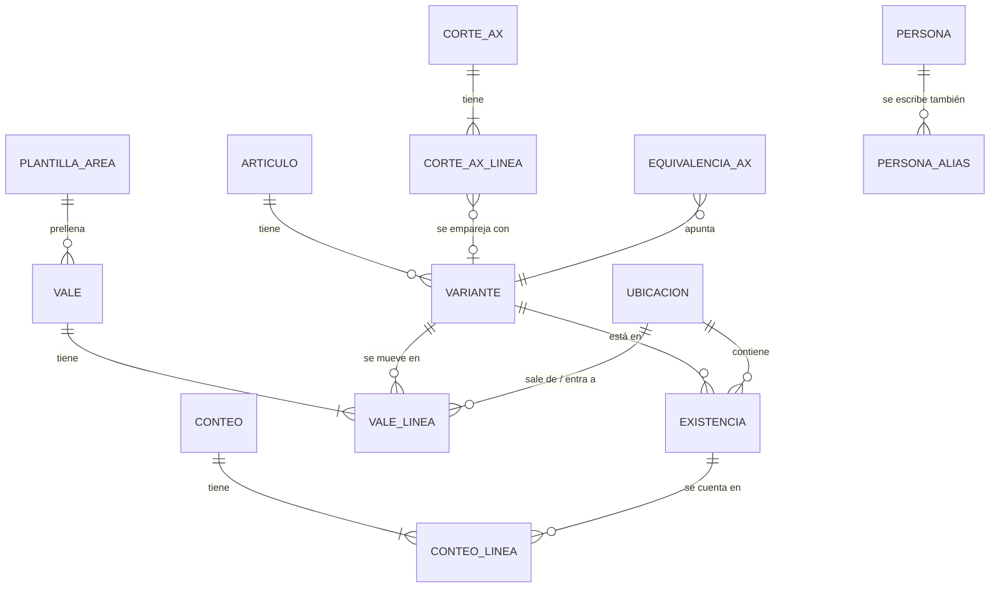

# 04 — Modelo de datos

## Conceptos

| Concepto | Qué es | Ejemplo |
|---|---|---|
| **Artículo** | Un código AX | `712 BALEROS` |
| **Variante** | Artículo + dimensión (+ NP) + UM. Es lo que se cuenta y se mueve. | `712 BALEROS · 6309-2Z/C3 · PZA` |
| **Ubicación** | Una hoja del inventario actual (contenedor + clase) | `CONTENEDOR #5 INVENTARIABLE` |
| **Existencia** | Una variante en una ubicación. Equivale a **un renglón del Excel de inventario**. | Baleros 6309-2Z/C3 en C5-INV |
| **Vale** | Documento de salida o entrada, con folio | Salida 555 |
| **Conteo** | Foto física que fija `CANTIDAD` y reinicia CONSUMO/INGRESO | Conteo del 28-sep-2026 |
| **Corte AX** | Un reporte de AX importado | AX al 27-sep-2026 |



## Tablas

### Catálogos

**`articulo`**
| Campo | Tipo | Notas |
|---|---|---|
| codigo | int PK | Código AX sin ceros a la izquierda |
| descripcion | texto | Descripción oficial |
| clase | `INV` / `CONS` / nulo | Inventariable o consumible (lista pendiente de la base) |
| modelo_ax | texto | `INV`, `CONPROV`… si se conoce |
| activo | bool | |

**`variante`**
| Campo | Tipo | Notas |
|---|---|---|
| id | PK | |
| codigo | FK articulo | |
| dimension | texto | Como se muestra y exporta (columna DIMENSION / CLAVE) |
| np | texto | Número de parte (columna NP) |
| um | texto | Unidad normalizada |
| dimension_clave, np_clave | texto | Normalización estricta (ver reglas abajo) |
| claves_anteriores | lista de texto | Cómo se escribía antes de corregir su dimensión / NP (Ronda 9): los vales viejos se siguen reconociendo |
| activo, unida_a | bool, FK | Al corregirla igual que otra variante, sus partidas pasan a esa y queda inactiva con `unida_a` |
| | | `UNIQUE(codigo, dimension_clave, np_clave)` |

**`ubicacion`**
| Campo | Tipo | Notas |
|---|---|---|
| id | PK | |
| contenedor | int | 1–5 |
| clase | `INV` / `CONS` | |
| hoja_excel | texto | Nombre exacto, **con espacios finales** si los tiene |
| tabla_excel | texto | `Tabla315`, etc. |
| orden | int | Orden de las hojas |

**`existencia`** (un renglón del Excel de inventario)
| Campo | Tipo | Notas |
|---|---|---|
| id | PK | |
| variante_id | FK | |
| ubicacion_id | FK | Sin restricción única: el inventario real tiene la misma variante repetida en una hoja (se señala en la revisión) |
| orden | int | Posición en la hoja. **Estable:** los renglones nuevos van al final. |
| item | int nulo | Valor de la columna ITEM |
| cantidad_conteo | decimal | La `CANTIDAD` del Excel |
| conteo_id | FK | Conteo que fijó esa cantidad |
| nota | texto | Nota de celda del Excel, si la hay |
| fila_origen | int | Fila del Excel importado (para conservar estilos y notas al exportar) |
| dimension_hoja, np_hoja, um_hoja | texto | Escritura exacta del renglón cuando difiere de la variante ("0-5,000PSI" vs "0-5000PSI"): se exporta tal cual |
| activo | bool | En 0 no se borra: el renglón sigue en el Excel con 0, como hoy |

**`persona`** (id, nombre, puesto, área, es_almacenista, activo) y **`persona_alias`** (alias → persona_id): unifican las variantes de nombre del historial.
En el estado es `estado.alias` (nombre escrito → id de persona). *Áreas y personas → Nombres repetidos* (ronda 8,
`servicios/personas.js`) lo usa para unificar: la persona que queda conserva su nombre y las demás pasan a ser alias
(salen de la lista; `Indices.persona` y las sugerencias de firmas las resuelven a la que queda). **Los vales no
cambian.** `config.personas_distintas` guarda los pares marcados como "no son la misma persona".

**`departamento`**, **`destino`**: listas simples.

**`plantilla_area`**: sustituye las 11 hojas-formulario (pantalla *Áreas y personas*).
| Campo | Notas |
|---|---|
| nombre | SOLDADOR, TOP DRIVE, … |
| tipo | `INTERNO` (departamento del equipo), `EXTERNO` (otra compañía, p. ej. NOV) o `TRANSFERENCIA` (a otro equipo). Si falta, se deduce: transferencia por nombre/naturaleza; externa si el destino es distinto del origen |
| hoja_excel | Hoja-formulario del libro de vales con la que se **imprime** el vale (nula = la del departamento) |
| origen, depto_origen, destino, depto_destino | Valores por defecto. En las **internas** son fijos: `RIG 91 · ALMACEN` → `RIG 91 · <depto del área>` |
| recibe_nombre, recibe_puesto | Receptor habitual |
| autoriza_nombre | Quién autoriza habitualmente (transferencias) |
| requiere_autoriza | Transferencias: sí (P-14) |
| naturaleza | `CONSUMO` / `TRANSFERENCIA` |
| observaciones | Las líneas fijas del formato (C44:C46). En las internas solo cambia, en cada vale, la línea `ETAPA DE PERFORACION: …` |
| lote_defecto | Se copia a la columna LOTE de cada renglón nuevo |
| autoriza_puesto | Puesto de quien autoriza (TRANSFERENCIAS: G59) |
| firmas_extra | `{izq, der}` con título, nombre y puesto de la segunda fila de firmas (NOV), o nulo |
| almacenista_derecha | El almacenista firma a la derecha (NOV) |
| activo | Las inactivas no se ofrecen al hacer vales |

### Movimientos

**`vale`**
| Campo | Tipo | Notas |
|---|---|---|
| id | PK | |
| tipo | `SALIDA` / `ENTRADA` | |
| folio | int | Se asigna al emitir (los borradores viven aparte, en `borradores`). `UNIQUE(tipo, folio)`. |
| folio_externo | texto | Entradas: folio del vale de la base |
| estado | `EMITIDO` (o `CANCELADO` en vales de versiones anteriores: ya no se cancela) | |
| fecha | fecha | |
| origen, depto_origen, destino, depto_destino | texto | Copia al momento de emitir |
| entrego_nombre, entrego_puesto, recibio_nombre, recibio_puesto, autorizo_nombre, autorizo_puesto | texto | Copia al emitir. Desde Personas se puede confirmar la actualización del puesto en los vales existentes, con bitácora. En los **migrados** de áreas con el almacenista a la derecha (NOV) vienen **por posición**, como los guardaba la macro: entregó = quien firma a la izquierda |
| firma_extra_izq_nombre/puesto, firma_extra_der_nombre/puesto | texto | Segunda fila de firmas del formato (NOV: personal de la compañía a la izquierda, patrimonial a la derecha) |
| fotos | lista de claves | Una por espacio de foto del formato (`null` = vacío); el archivo está en IndexedDB y en los respaldos |
| almacenista_derecha | bool | El área firma con el almacenista a la derecha: al exportar, P = izquierda y Q = derecha, como la macro |
| entrego_id, recibio_id, autorizo_id | FK persona nulas | |
| observaciones | texto | |
| plantilla_area_id | FK | |
| naturaleza | `CONSUMO` / `TRANSFERENCIA` | Para la columna TRANSFERENCIA/CONSUMO |
| creado_por, creado_en, emitido_en, modificado_en | | |
| cancelado_en, motivo_cancelacion | | Solo en vales cancelados con versiones anteriores |
| cambio | int | Contador global que sube en cada emisión o corrección; decide qué hay **por enviar** |
| enviado_en | fecha-hora nula | Primera vez que se marcó como enviado a la base |
| ruta_escaneo | texto | Enlace o ruta del PDF escaneado (opcional) |
| migrado, fila_diario_origen | | Trazabilidad de la migración |
| campos_encabezado_corregidos | lista de texto opcional | Desde el formato 10 de la rama de vales, conservado en el formato 14 fusionado: campos generales corregidos. Las claves del DIARIO (`fecha`, `entrego`, `recibio`…) prevalecen sobre `encabezado_original`; los puestos y observaciones marcados respetan también un vacío explícito al imprimir |
| firmas_por_posicion | bool opcional | Conserva la interpretación de las firmas de un vale migrado aunque se corrija su departamento; `false` también es un valor válido |

**`vale_linea`**
| Campo | Tipo | Notas |
|---|---|---|
| id | PK | |
| vale_id | FK | |
| renglon | int | 1–21 (la capacidad real es la del formato impreso: 19–21 según la hoja) |
| oc | texto | En blanco se exporta como `S/OC` |
| cantidad | decimal > 0 | |
| codigo | int | Copia |
| descripcion | texto | Copia |
| clave | texto | Lo que va a la columna CLAVE (dimensión / NP) |
| um | texto | |
| lote | texto | Columna LOTE → "C.U" en DIARIO |
| existencia_id | FK nulo | **Renglón del inventario** de donde sale o a donde entra (resuelve el caso de variantes repetidas) |
| variante_id | FK nulo | Copia de la variante de esa existencia |
| no_inventariado | bool | Diésel, gases, servicios o artículos sin existencia: no descuentan |
| familia, transferencia_consumo | texto | Columnas S y T del DIARIO (vacías en vales nuevos, como en los recientes del Excel, P-13) |
| justificacion | texto | Obligatoria si la cantidad supera la existencia del renglón elegido |
| encabezado_original | JSON | Migración: encabezado del renglón cuando difería del del vale. Se conserva intacto; al exportar sólo se reemplazan los campos incluidos en `vale.campos_encabezado_corregidos` |

**`conteo`**: id, fecha, `alcance` (`TOTAL` / `PARCIAL`), `ubicaciones` (ids contados), usuario, observaciones,
`ultimo_folio_salida` y `ultimo_folio_entrada` (corte: vales ya reflejados en lo contado), `lineas` y `nuevos`.
Cada línea guarda `existencia_id`, `contado`, `teorico` (el TOTAL que decía el sistema), `cantidad_anterior` y
`conteo_anterior_id` (el historial no se pierde). `nuevos` son los renglones creados por material encontrado. Un
conteo con `tipo: "REACOMODO"` lo genera un movimiento entre contenedores (ver abajo) y no se lista como conteo físico.

**`conteo_en_curso`** (uno a la vez): el conteo mientras se captura (`ubicaciones`, `corte` = folios al empezar,
`capturas` {existencia_id → contado}, `nuevos` [sobrantes], `fecha`). No cambia el inventario hasta aplicarlo.

**`reacomodos`**: fecha, usuario, `desde_existencia_id`, `hacia_existencia_id`, `renglon_nuevo`, código, clave, UM,
`cantidad`, hojas de origen y destino, `conteo_id` (el REACOMODO que fijó ambos renglones) y motivo.

**`existencia.origen`**: en los renglones creados por la herramienta, qué los creó (`ENTRADA E-0003`,
`CONTEO 05/10/2026`, `REACOMODO desde #1 Inv.`). Van al final de su hoja y empiezan sin conteo propio.

**`borrador`** (lista `borradores` del estado): vales en captura, uno por pestaña. Mismos campos de encabezado y
renglones que `vale`, sin folio. Se guardan solos mientras se escribe y **no consumen folio**; al emitir se validan,
reciben folio dentro de un cambio atómico y pasan a `vales`. Descartar un borrador no deja huella en los folios.

**`envio`** (lista `envios`): cada vez que el almacenista marca "ya lo envié a la base".
| Campo | Notas |
|---|---|
| fecha_hora, usuario | |
| hasta_cambio | Valor del contador `cambio` al marcar: lo que tenga `cambio` mayor está **por enviar** (nuevo o corregido) |
| ultimo_folio, folios | Para la bitácora |

### Conciliación

| Tabla | Campos |
|---|---|
| **`corte_ax`** | fecha_corte, almacen, archivo, hash, importado_en, folio_corte (opcional), fecha_minima_vales |
| **`corte_ax_linea`** | corte_id, las 10 columnas del reporte, variante_id resuelta, método (`exacto` / `equivalencia` / `aproximado` / `manual` / `sin_pareja`), puntaje |
| **`equivalencia_ax`** | (codigo, tamano, color) → variante_id, confirmado_por, fecha. **Memoria de emparejamientos.** |

En el estado (formato 6, F4): `estado.cortes_ax = [{ id, fecha, almacen, archivo, huella, folio_salida, importado_en,
importado_por, lineas: [{ id, fila, codigo, codigo_texto, nombre, modelo, um, almacen, tamano, color, disponible,
valor_financiero, valor_inventario }] }]` (textos tal como vienen del reporte; cantidades y valores como texto decimal)
y `corte.sin_pareja = [línea…]` (las partidas de AX que el usuario marcó "no está en el físico", **solo en ese corte**).
Desde el formato 14, `corte.fecha_minima_vales` es una fecha ISO editable por corte. Se propone el **1 de noviembre
del año anterior a `corte.fecha`**. Las sugerencias, las asignaciones manuales, el tránsito y la solicitud de ajuste
admiten únicamente vales cuya `fecha` sea válida y esté dentro del periodo. Las asignaciones guardadas que queden fuera
se conservan para revisión, pero no cuentan. La fecha del vale, y no `fecha_recibido`, determina este límite de AX.
Desde la Ronda 9 **confirmar una pareja corrige el inventario** (`corregirDimensionNp`: la dimensión y el NP de la
variante pasan a como los escribe AX) en vez de recordar una equivalencia; `estado.equivalencias_ax` (formato 6) solo
conserva lo que se confirmó con la versión anterior: esas parejas se vuelven a proponer ("confirmada antes") y, al
confirmarlas, se corrige el inventario y se borran. La pareja de cada partida **no se guarda**: se calcula cada vez
(`servicios/conciliacion.js`, `emparejar`). Solo se concilian las partidas con **Modelo de Inventario = INV**
(`lineasInv`); los códigos que en AX solo vienen con otro modelo tampoco se comparan del lado físico.
`config.almacen_ax` = almacén que se filtra (por defecto `RIG91-IX25`).

**Archivo de vales de la base (formato 7, Rondas 12 y 13):** `estado.seguimientos_base = [{ id, archivo, huella,
guardado, importado_en, importado_por, ultimo_folio, partidas: [{ fila, fecha, folio, codigo, clave, cantidad, entrada,
inv, mov, aplicada, tr, in, comentario }] }]`. **Solo se guarda uno** (el último importado; importar otro lo reemplaza)
y su fecha no importa: `guardado` (cuándo lo guardó Excel, de `docProps/core.xml`) es informativo. Los importados con
la Ronda 12 pueden traer `fecha`; se ignora. Los textos de la base (INV/NINV, TIPO DE MOV, CANTIDAD aplicada, TR, IN)
se guardan como vienen. El estado en AX de cada partida **no se guarda**: se calcula (`estadoAxDeVales`).

**Dos inventarios (formato 9, Ronda 17):** `config.inventario` = `DLTA` | `GSM` (los estados anteriores se migran como
DLTA). Cada inventario es un estado aparte, en su propia base de IndexedDB; nunca se mezclan. `config.almacen_ax` se
propone por inventario (DLTA `RIG91-IX25`; GSM ninguno: el primero del reporte, y se recuerda el elegido).
`config.vale_impreso = { textos: [{ buscar, poner }], logos: { <huella de la imagen>: { src, nombre, guardado_en } |
{ quitar: true } } }` (opcional): lo que se cambia **al imprimir** sobre la hoja-formulario (textos fijos y logos del
formato), por ejemplo el nombre del almacén y la dirección de DLTA en el vale de GSM. Los textos se reemplazan sin
importar mayúsculas ni espacios de más y nunca tocan lo capturado en el vale; el logo nuevo va como `data:` URL (≤ 300 KB)
para que viaje en los respaldos. Ver `src/impresion/identidad.js` y `src/servicios/valeImpreso.js`.

**Ajustes compartidos (Rondas 18 y 19):** `config.etapa_perforacion`, `config.personalizacion`, `config.captura_rapida` y
`config.preferencias_vale` son los mismos en DLTA y GSM. Cada estado conserva su copia (va en sus respaldos) y se
sincroniza con la base común `control-almacen-comun` (ver `docs/03`). No cambia el formato del estado.

**Quitar áreas (Ronda 19):** un área (`plantillas_area`) que ningún vale ni borrador usa (`plantilla_area_id`) se
**borra** (`borrarArea`, con *Deshacer* = `reponerArea`); la que se usa solo se **descarta** (`activo: false`,
`descartarArea`): deja de salir al hacer vales, sus vales se siguen imprimiendo con su formato y se puede recuperar. Los
vales migrados del DIARIO no apuntan a un área. Auditoría `BORRAR`, `REPONER`, `DESCARTAR`, `RECUPERAR`.

**Etiquetas (formato 10, Ronda 20):** `estado.etiquetas = { material: [...], ax: [...] }` (lo que está por imprimir;
cada etiqueta es una copia: cantidad 1–999, código, nombre, dimensión, NP, descripción, área, `inventario` DLTA | GSM y su
`origen` — entrada, inventario, a mano o archivo del generador) y `estado.impresiones_etiquetas = [{ id, fecha_hora,
usuario, tipo, partidas, etiquetas, vales }]` (bitácora; una entrada tiene etiquetas si su id está en `vales`). Los vales
no cambian. `config.etiquetas = { diseno, identidad: { DLTA: { logo_izq, logo_der, texto }, GSM: … } }` es compartido entre
DLTA y GSM. Detalle en `docs/11-etiquetas.md`.
Al corregir dimensión / NP desde Conciliación AX se agrega a `etiquetas.material` una etiqueta por partida física
modificada, con los datos corregidos. Su `origen` conserva `existencia_id` e inventario y agrega `corte_ax_id` y
`linea_ax_id` (null al corregir lo que solo está en el físico). Deshacer la corrección retira solo esas etiquetas nuevas.

**Etiquetas de DLTA y GSM juntas (formato 11, Ronda 21):** la lista por imprimir y la bitácora son **las mismas en los
dos inventarios** (se sincronizan con la base común como los ajustes compartidos; cada estado guarda su copia, que va en
sus respaldos). Los ids llevan el inventario que los creó (`DLTA-12`, `GSM-3`) para no chocar; `origen.inventario` dice de
qué inventario es la partida o la entrada; la bitácora marca `vales: [{ inventario, vale_id, emitido_en }]` (el id de un
vale se repite si se restaura un respaldo: `emitido_en` dice cuál era); la lista lleva
`cambiado_en` (gana el último cambio) y, si venía con etiquetas del formato 10, `juntar: true` (la primera vez se une con
la del otro). La migración convierte los ids numéricos y los `vales` anteriores.

**Vales asignados a faltantes (formato 8, Ronda 14):** `corte.asignaciones = [{ id, partida_id, vale_id, folio, codigo,
cantidad, variante_id | linea_ax_id, metodo: "sugerida" | "manual", por, en }]`. Cada partida de vale se asigna una sola
vez por corte, a una variante (fila emparejada) o a una partida de AX sin físico. `transitoDesde` la cuenta para ese
destino sea cual sea su fecha (marca `asignado`); si la variante se juntó con otra, sigue `unida_a`. Las cantidades y los
vales no cambian. La migración agrega `asignaciones: []` a los cortes anteriores.

### Operación

| Tabla | Campos |
|---|---|
| **`plantilla_excel`** | tipo (`INVENTARIO` / `VALES`), ruta, hash, fecha, activa |
| **`exportacion`** | tipo, fecha, archivo, hash, usuario, último folio incluido, marcada como enviada |
| **`auditoria`** | fecha_hora, usuario, entidad, entidad_id, acción, antes (JSON), después (JSON), motivo |
| **`config`** | clave / valor (almacén AX, retención de respaldos, almacenista en turno, `etapa_perforacion` actual, `captura_rapida`, `preferencias_vale`…) |

El siguiente folio es siempre `último folio + 1`: los folios no se saltan (el antiguo `folio_minimo_salida` se
elimina al migrar). Los vales hechos fuera de la herramienta se traen del Excel para no dejar huecos.

El estado lleva `formato` (hoy **14**; del 6 al 12 se describen arriba en *Conciliación*, *Dos inventarios* y *Etiquetas*;
el 12 completa `emitido_en` en las marcas de etiquetas de las entradas propias; el 13 agrega `fecha_recibido` a las
entradas y a sus borradores, ver *Vales de entrada*; el 14 reúne los marcadores de correcciones generales de la rama de vales y la fecha mínima de justificantes AX). Al abrir un estado o un respaldo de un formato anterior se migra solo
(`migrarEstado`): el formato 2 agregó `borradores` y `envios`; el 3, el `tipo` de cada área (las internas pasan a salir
de `RIG 91 · ALMACEN`), `config.etapa_perforacion` (tomada de las observaciones del formato) y `config.captura_rapida`;
el 4 quita el folio mínimo, da datos fijos también a las externas (NOV) y, al abrir, vuelve a leer las hojas-formulario
para completar `autoriza_puesto`, `firmas_extra` y `almacenista_derecha` de cada área; el 5 agrega
`borradores_entrada`, `conteo_en_curso` y `reacomodos`, y marca los conteos anteriores como `alcance: TOTAL`.

Los borradores llevan además `etapa_perforacion`. Entregó no se captura: al emitir es siempre el almacenista en turno.

**Clave y lote de una partida** (comentario del usuario, ronda 5): al elegir un renglón del inventario, CLAVE ALMACÉN =
su dimensión tal cual y LOTE = su NP (`claveDeRenglon`, `loteDeRenglon`, `conLoteDeNp` en `servicios/vales.js`). Un lote
puesto así se reemplaza si cambia el renglón elegido; uno escrito a mano se respeta. **En las entradas no:** el LOTE es
quien solicita el material (ronda 6).

**Campos opcionales de la ronda 6** (no cambian `FORMATO_ESTADO`: si faltan se usan los valores de siempre):
`borrador_entrada.modo` (`null` = aún no elige, `manual`, `asistida`); `vale.subido_cambio` (cambio con el que el vale
se marcó como subido al SharePoint en un envío parcial del reporte diario; `envio.parcial`); y
`config.personalizacion[almacenista | "*"] = { tema: sistema|claro|oscuro, avisos: arriba|abajo, animaciones }`
(`"*"` = la del equipo cuando no hay nadie en turno).

**Vales de entrada** (`vale.tipo = ENTRADA`): `folio` es el consecutivo interno propio (se muestra `E-0001`),
independiente del de salidas; `folio_externo` = folio del vale que llega (obligatorio); `origen` = de dónde viene;
`depto_origen` siempre `ALMACEN`; `devolucion_folio` (opcional) = vale de salida del que se copiaron las partidas
(`motivo` queda `DEVOLUCION` en ese caso y `BASE` en los demás, solo como referencia); destino `RIG 91 · ALMACEN`,
entregó = quien trae el material y recibió = almacenista en turno. Cada renglón lleva su `existencia_id` (el renglón
del inventario al que entra; si era una variante o un contenedor nuevos, se crean al confirmar) o `no_inventariado`.
**`borradores_entrada`**: entradas en captura, con el mismo encabezado y renglones que además pueden traer
`ubicacion_id` + `variante_id` (otro contenedor) o `ubicacion_id` + `dimension`/`np` (variante nueva).

**Dos fechas en las entradas (formato 13, Ronda 22):** `fecha` = la **del vale** (cuando la base lo envió; la trae el
papel y la llena la captura con Copilot) y `fecha_recibido` = cuándo **llegó** el material y se registra (por omisión,
hoy). La de recibido decide el **día** de la entrada: la vista diaria del inventario (`calcularSaldos(…, { dia })`), el
reporte diario (`estadoAlCierre`, `reporteDelDia`), los contadores del inicio y los filtros del historial de entradas.
Un solo ayudante, `fechaDelDia(vale)` (`nucleo/fechas.js`): `fecha_recibido ?? fecha` en las entradas, `fecha` en las
salidas. La **conciliación con AX** (`transitoDesde`/`enTransito`), el archivo de la base y la justificación siguen con la
fecha del vale: la base mueve el material en AX cuando lo envía. Se valida en el servicio: obligatoria, no futura y no
posterior al día en que se registra la entrada (al corregir, el día de `emitido_en`); avisa sin bloquear si es anterior a
la del vale o a un conteo físico posterior de los renglones de destino que la entrada todavía suma
(`conteosDespuesDeRecibir`: si ya se contó, sumaría dos veces). Es editable con *Corregir* (motivo y bitácora:
«Recibido: … → …»). Migración: las entradas ya registradas toman `fecha_recibido = fecha` (no cambia ningún reporte ya
subido); los borradores, **hoy** (un día pasado podría cambiar un reporte ya subido, y queda a la vista para cambiarlo
antes de registrar; no se usa la fecha del borrador porque puede ser la del vale, que puso Copilot). El corte por folio
de cada conteo **no cambia**.

`config.preferencias_vale` guarda, por nombre de almacenista, cómo quiere ver la pantalla del vale:
`{ "<ALMACENISTA>": { "orden": ["area", "fecha", …], "lado": "datos-izquierda" | "partidas-izquierda" } }`
(`src/servicios/preferencias.js`). Es opcional y se completa al leerla (bloques desconocidos o repetidos se quitan y los
que falten se insertan en su lugar de fábrica), así que no cambia el formato ni necesita migración; viaja en los respaldos.

## Cálculo de existencias

Para cada renglón `existencia` (variante `v` en ubicación `u`), con su último conteo `c`:

```
CANTIDAD = existencia.cantidad_conteo
CONSUMO  = Σ cantidad de vale_linea  (vale SALIDA, EMITIDO, variante v, ubicación u, folio > c.ultimo_folio_salida)
INGRESO  = Σ cantidad de vale_linea  (vale ENTRADA, EMITIDO, variante v, ubicación u, folio > c.ultimo_folio_entrada)
TOTAL    = CANTIDAD + INGRESO − CONSUMO      ← en el Excel sigue siendo fórmula
```

El corte se hace **por folio, no por fecha**. Así no hay ambigüedad cuando un vale y un conteo ocurren el mismo día.

**Vista diaria (Ronda 16), como el Excel del almacén:** el inventario de un día `D` (la página *Inventario* con `D` =
hoy, el inventario exportado y el del reporte diario con `D` = su fecha) reparte lo mismo de otra forma:

```
CANTIDAD (al empezar D) = cantidad_conteo − salidas de días anteriores a D + entradas recibidas antes de D
CONSUMO  (de D)         = salidas del día D (y posteriores)
INGRESO  (de D)         = entradas recibidas el día D (y después)
TOTAL                   = el mismo de arriba
```

Así, como en el Excel, CONSUMO e INGRESO "se limpian" al pasar el día: lo de ayer ya está en la CANTIDAD (el día de una
entrada es el de recibido, Ronda 22; `fechaDelDia`). Solo los vales
posteriores al conteo de cada renglón cuentan (el corte por folio no cambia) y nada de esto se guarda
(`calcularSaldos(estado, ids, { dia })`; el saldo trae `conteo` = lo contado y `cantidad` = al empezar el día).

**Cada renglón tiene su propio conteo** (`existencia.conteo_id`). Un conteo parcial solo cambia los renglones que se
contaron; los demás siguen descontando desde su conteo anterior. Por eso "el folio de corte" ya no es uno solo:
`cortesVigentes` da el más antiguo en uso (lo usan *Pendientes*, *Traer vales del Excel* y la marca "Anterior al
conteo" de un vale). Un renglón creado por la herramienta sin conteo cuenta todos sus movimientos.

**Reacomodo** (mover material entre contenedores): los dos renglones quedan como recién contados, CANTIDAD = lo que
queda en cada uno (origen: TOTAL − movido; destino: TOTAL + movido) y un conteo `REACOMODO` con el corte de ese momento.
Así el total no cambia, CONSUMO / INGRESO siguen siendo solo vales y la CANTIDAD nunca queda negativa.

## Reglas de normalización

| Regla | Detalle |
|---|---|
| Código AX | `000000670` → `670` |
| Texto general | Mayúsculas, sin espacios al inicio o al final, espacios múltiples → uno, comillas tipográficas (`” ″ ''`) → `"` |
| `*_clave` (estricta) | Texto general + quitar espacios, guiones y puntos. **Conserva `/` y `"`** para no confundir `1/2"` con `12`. Se usa para unicidad. |
| Clave laxa | Solo `A-Z0-9`. Se usa **solo para sugerir** parejas, nunca para fusionar automáticamente. |
| Truncado de AX | `Tamaño` de AX = primeros 10 caracteres. Si la dimensión física empieza con el Tamaño de AX, es candidata. |
| Tamaño + Color | Juntos son la DIMENSION (AX no trae NP). Para comparar se prueban `Tamaño + " " + Color`, `Tamaño` sin Color y, por tolerancia, `Color` anotado en NP. |
| UM | Tabla de equivalencias: `PZA␠` / `pza` / `PZ A` → `PZA`, `CUB` → `CUBETA`, `LITROS` → `LTS`, `M` → `MTS`… |
| Nombres | Tabla `persona_alias`, confirmada por el usuario en la migración |
