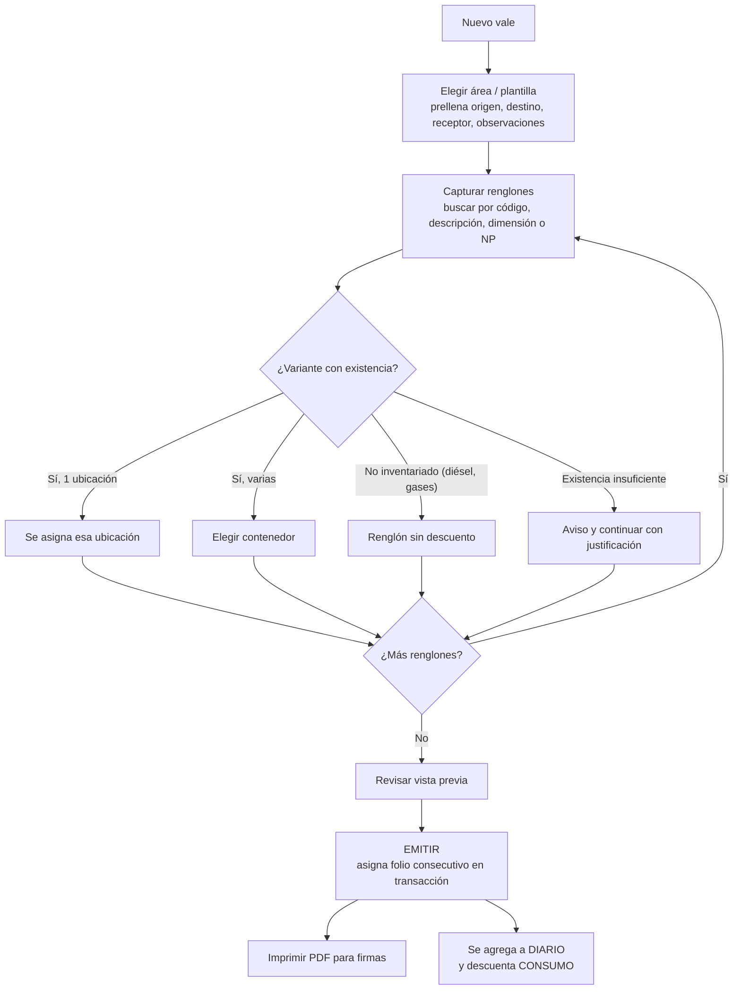
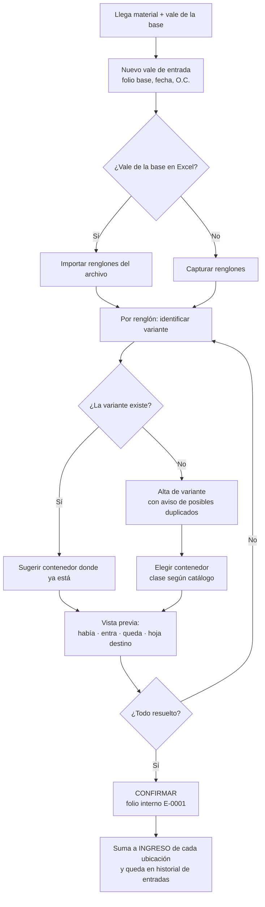

# 05 — Flujos de trabajo

## 1. Vale de salida (consumo o transferencia)

- **Borradores:** se pueden tener varios abiertos en pestañas. No consumen folio y se guardan automáticamente (sobreviven a cerrar la pestaña).
- **Pantalla:** a la izquierda los datos del vale: primero lo que se captura (área, fecha; en transferencias origen y destino; personas, etapa) y al final, en "Se llenan solos", lo automático (quién entrega, de dónde sale, a dónde llega y las observaciones fijas). Al centro las **partidas** y, debajo, en su propia sección, las **fotos** (NOV). Las partidas van con las mismas columnas y en el mismo orden que el vale impreso (O.C., cantidad, código, descripción, clave almacén, presentación, lote). Lo que viene del inventario (contenedor, existencia) se muestra en **pastillas grises**, aparte de lo que se imprime.
- **Pantalla de cada almacenista (Ajustes → Mi pantalla de vales):** el orden de los bloques del panel de datos se cambia arrastrándolos por sus puntitos (o con ↑ ↓) en una vista previa, y un botón pasa los datos al otro lado de las partidas. Se guarda por almacenista y se aplica según quién está en turno; lo descrito arriba es el acomodo de fábrica (*Restablecer como venía*).
- **Vales internos** (todo menos NOV y transferencias): salen de `RIG 91 · ALMACEN` y llegan a `RIG 91 · <área>`; no se capturan. **Entregó** es siempre el almacenista en turno. **Autorizó** solo aparece en transferencias. Las **observaciones** son el texto fijo del área y solo cambia la **etapa de perforación**, que se recuerda para el siguiente vale.
- **Recibió:** se busca por nombre, por puesto o por el área a la que la persona suele recibir ("mecánico" lista a los mecánicos); al elegirla se llena su puesto.
- **Partidas (paso a paso):** código AX → `Enter` → **clave**: la lista muestra solo las claves de ese código en el inventario, cada una con su contenedor y existencia (si solo hay una, se elige sola) → `Enter` → cantidad → `Enter` pasa a la siguiente partida. "Otra clave" deja la partida como no inventariada (no descuenta). Un artículo sin existencia (diésel) queda no inventariado y la clave se escribe a mano; un código que no está en el catálogo se acepta con su descripción y queda "por confirmar".
- **Búsqueda rápida (opcional, en Ajustes):** un buscador por cualquier dato que llena la partida completa con `Enter`.
- **Validaciones antes de emitir:** fecha, departamento destino, entregó, recibió, cantidad > 0, UM, "Sale de" elegido. Si la cantidad supera la existencia del contenedor elegido se pide una **justificación** (queda en el renglón).
- **Emitir** es el único paso que asigna folio: el último + 1, dentro de un cambio atómico con candado de pestaña única. Un vale con errores no consume folio. **Todos los folios se usan:** ninguno se cancela ni se salta.
- **Más renglones que el formato:** cada hoja-formulario tiene su capacidad (21, 20 u 19 renglones). Si el vale la supera, la herramienta avisa y ofrece dividirlo en folios consecutivos (P-16).
- **Transferencias:** la plantilla `TRANSFERENCIAS` exige "Autorizó" y marca la naturaleza como `TRANSFERENCIA`.
- **NOV (diésel):** área externa con datos fijos (sale de `RIG 91 · ALMACEN` hacia el tanque de NOV; observaciones fijas + etapa). Lleva **4 firmas**: a la izquierda el químico (arriba, "Recibió") y el personal de NOV (abajo); a la derecha el almacenista (arriba) y patrimonial (abajo). Las personas y la partida de diésel (sin cantidad) se toman del último vale NOV hecho en la herramienta. Lleva **3 fotos**, que se imprimen en el lugar y tamaño de las del formato; las partidas caben arriba de ellas (4). En el DIARIO, como hacía la macro, "Entrego" es el químico y "Recibio" el almacenista.
- **Autorizó (transferencias):** nombre y puesto; se sugieren primero RIG MANAGER e ITP.
- **Personas:** se muestra su puesto; quien más ha firmado para esa área aparece primero.
- **Impresión:** el vale se dibuja sobre **la hoja-formulario del propio libro de vales** (logo, colores, bordes, anchos, observaciones y pie de página) en tamaño carta, y se imprime o se guarda como PDF desde el navegador. La vista previa de un borrador lleva `BORRADOR` en el folio.
- **Folios hechos fuera de la herramienta:** si se siguieron haciendo vales en el Excel, *Exportar y enviar → Traer vales hechos en el Excel* agrega los folios posteriores al último conocido. No hay forma de saltar folios: los hechos fuera se traen del Excel.

## 2. Vale de entrada (material recibido de la base)

**Así se evita meter material al contenedor equivocado:**
1. Si la variante ya vive en un contenedor, se propone ese.
2. Si vive en varios, se propone el que tiene más existencia.
3. La vista previa muestra el nombre exacto de la hoja del Excel donde quedará.
4. Nada se aplica hasta confirmar, y una entrada confirmada se puede **corregir** con motivo (como los vales de salida, sin cancelar folios).

## 3. Corrección y devolución

| Caso | Qué hace la herramienta |
|---|---|
| **Error de captura** en un vale emitido | *Historial → folio → Corregir*. El **motivo se llena solo** con lo que cambió (partidas agregadas, quitadas o modificadas, personas, etapa, fotos) y se puede completar con el porqué. El folio no cambia. La bitácora guarda el motivo, la lista de cambios y antes → después; la existencia se recalcula sola. En un vale anterior al conteo solo cambia el historial (no mueve existencias). |
| **Vale que no debió emitirse** | No se cancela (todos los folios se usan): se corrige para que refleje lo que realmente salió. |
| **Devolución de material** | Pendiente de confirmar (P-08). Opción A: corregir el vale original. Opción B: vale de entrada tipo "Devolución" que referencia el folio original. |
| **Vale ya enviado a la base y luego corregido** | Vuelve a aparecer en *Exportar y enviar → Por enviar a la base* con el cambio "Corregido", para avisar a la base. |

## 4. Conteo físico

1. Elegir el alcance: todo o algunos contenedores.
2. (Opcional) Imprimir la hoja de conteo por contenedor, sin cantidades.
3. Capturar lo contado. La herramienta muestra la diferencia contra el teórico (`TOTAL`) antes de aplicar.
4. Aplicar: `CANTIDAD` = contado, y CONSUMO/INGRESO se reinician. El conteo registra el último folio de salida y de entrada incluidos.
5. El conteo anterior queda en el historial.

## 5. Conciliación contra AX

- **Existencia física para comparar:** el `TOTAL` calculado de todas las ubicaciones de esa variante.
- **Vales en tránsito:** los vales (salidas y entradas) posteriores al corte AX. Se usa la fecha de corte o, si se conoce, el último folio aplicado por la base (P-03).
- **Diferencia explicada** = físico − AX + salidas en tránsito − entradas en tránsito. Si da 0, la diferencia se marca como "explicada por vales" y se listan los folios.
- **Valuación:** costo unitario = Valor financiero / Disponible del renglón AX.

## 6. Exportación y envío diario

1. **Exportar → Vales:** genera `VALES DE SALIDA DLTA.xlsm` sobre la plantilla registrada, con `DIARIO` completo y actualizado.
2. La herramienta valida el archivo, lo guarda en la carpeta de exportaciones y registra hasta qué folio se incluyó.
3. El usuario lo envía por correo como hoy y pulsa **"Ya lo envié: marcar como enviado"**. La lista *Por enviar a la base* muestra los vales nuevos o corregidos desde el último envío (se lleva con un contador de cambios, no con la hora, para que no se escape ninguno).
4. **Exportar → Inventario:** genera el `.xlsx` con fecha en el nombre, cuando se necesite.

## 7. Cambio de guardia

1. El almacenista que sale genera el **resumen de guardia**: vales emitidos, entradas, cancelaciones, pendientes de envío y alertas.
2. El que entra elige su nombre al abrir; desde ese momento los movimientos quedan a su nombre.

## 8. Respaldo y restauración

- Los respaldos automáticos funcionan como se describe en [03-arquitectura.md](03-arquitectura.md#almacenamiento-y-respaldos).
- **Equipo o navegador nuevo:**
  1. Abrir `ControlAlmacen.html` en Edge (no se instala nada).
  2. **Respaldos → Restaurar desde un archivo…** y elegir el `.zip` más reciente de `OneDrive\ControlAlmacen\respaldos`.
  3. La herramienta valida el respaldo (formato, folios únicos, plantillas completas) antes de reemplazar.
  4. Elegir otra vez la carpeta de respaldos; queda lista.
