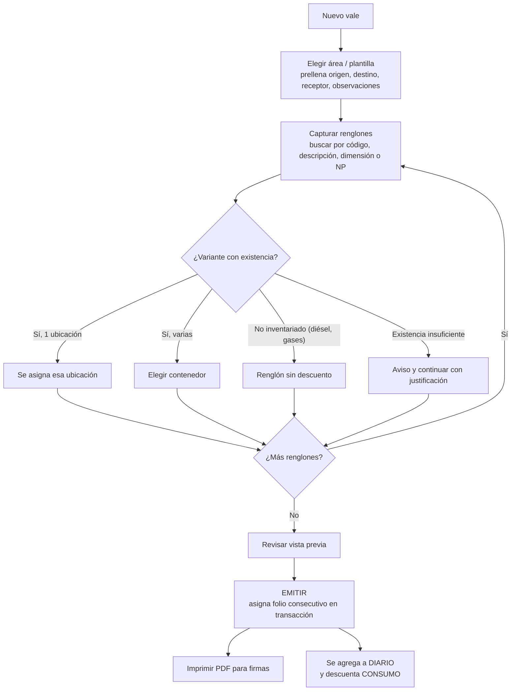
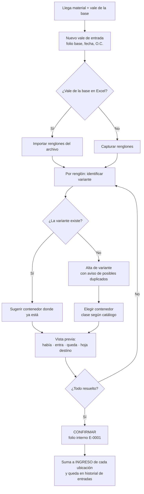

# 05 — Flujos de trabajo

## 1. Vale de salida (consumo o transferencia)

- **Borradores:** se pueden tener varios abiertos en pestañas. No consumen folio y se guardan automáticamente (sobreviven a cerrar la pestaña). Descartar uno es inmediato y el aviso ofrece **Deshacer**.
- **Pantalla:** a la izquierda los datos del vale: primero lo que se captura (área, fecha; en transferencias origen y destino; personas, etapa) y al final, en "Se llenan solos", lo automático (quién entrega, de dónde sale, a dónde llega y las observaciones fijas). Al centro las **partidas** y, debajo, en su propia sección, las **fotos** (NOV). Las partidas van con las mismas columnas y en el mismo orden que el vale impreso (O.C., cantidad, código, descripción, clave almacén, presentación, lote). Lo que viene del inventario (contenedor, existencia) se muestra en **pastillas grises**, aparte de lo que se imprime.
- **Pantalla de cada almacenista (Ajustes → Mi pantalla de vales):** el orden de los bloques del panel de datos se cambia arrastrándolos por sus puntitos (o con ↑ ↓) en una vista previa, y un botón pasa los datos al otro lado de las partidas. Se guarda por almacenista y se aplica según quién está en turno; lo descrito arriba es el acomodo de fábrica (*Restablecer como venía*).
- **Vales internos** (todo menos NOV y transferencias): salen de `RIG 91 · ALMACEN` y llegan a `RIG 91 · <área>`; no se capturan. **Entregó** es siempre el almacenista en turno. **Autorizó** solo aparece en transferencias. Las **observaciones** son el texto fijo del área y solo cambia la **etapa de perforación**, que se recuerda para el siguiente vale.
- **Recibió:** se busca por nombre, por puesto o por el área a la que la persona suele recibir ("mecánico" lista a los mecánicos); al elegirla se llena su puesto.
- **Partidas (paso a paso):** código AX → `Enter` → **clave**: la lista muestra solo las claves de ese código en el inventario, cada una con su contenedor y existencia (si solo hay una, se elige sola) → `Enter` → cantidad → `Enter` pasa a la siguiente partida. "Otra clave" deja la partida como no inventariada (no descuenta). Un artículo sin existencia (diésel) queda no inventariado y la clave se escribe a mano; un código que no está en el catálogo se acepta con su descripción y queda "por confirmar".
- **Búsqueda rápida (opcional, en Ajustes):** un buscador por cualquier dato que llena la partida completa con `Enter`.
- **Validaciones antes de emitir:** fecha, departamento destino, entregó, recibió, cantidad > 0, UM, "Sale de" elegido. Si la cantidad supera la existencia del contenedor elegido se pide una **justificación** (queda en el renglón).
- **Emitir** es el único paso que asigna folio: el último + 1, dentro de un cambio atómico con candado de pestaña única. Un vale con errores no consume folio. **Todos los folios se usan:** ninguno se cancela ni se salta.
- **Más renglones que el formato:** cada hoja-formulario tiene su capacidad (21, 20 u 19 renglones). Si el vale la supera, la herramienta avisa y ofrece dividirlo en folios consecutivos (P-16).
- **Transferencias:** la plantilla `TRANSFERENCIAS` exige "Autorizó" y marca la naturaleza como `TRANSFERENCIA`.
- **NOV (diésel):** área externa con datos fijos (sale de `RIG 91 · ALMACEN` hacia el tanque de NOV; observaciones fijas + etapa). Lleva **4 firmas**: a la izquierda el químico (arriba, "Recibió") y el personal de NOV (abajo); a la derecha el almacenista (arriba) y patrimonial (abajo). Las personas y la partida de diésel (sin cantidad) se toman del último vale NOV hecho en la herramienta. Lleva **3 fotos**, que se imprimen en el lugar y tamaño de las del formato; las partidas caben arriba de ellas (4). En el DIARIO, como hacía la macro, "Entrego" es el químico y "Recibio" el almacenista.
- **Autorizó (transferencias):** nombre y puesto; se sugieren primero RIG MANAGER e ITP.
- **Personas:** se muestra su puesto; quien más ha firmado para esa área aparece primero.
- **Impresión:** el vale se dibuja sobre **la hoja-formulario del propio libro de vales** (logo, colores, bordes, anchos, observaciones y pie de página) en tamaño carta, y se imprime o se guarda como PDF desde el navegador. La vista previa de un borrador lleva `BORRADOR` en el folio.
- **Folios hechos fuera de la herramienta:** si se siguieron haciendo vales en el Excel, *Exportar y enviar → Traer vales hechos en el Excel* agrega los folios posteriores al último conocido. No hay forma de saltar folios: los hechos fuera se traen del Excel.

## 2. Vale de entrada (material recibido de la base)

**Así se evita meter material al contenedor equivocado:**
1. Si la variante ya vive en un contenedor, se propone ese.
2. Si vive en varios, se propone el que tiene más existencia (★ sugerido); "Entra a" permite elegir otro (si la
   variante no está ahí, se crea su renglón al final de esa hoja).
3. Una dimensión nueva (variante nueva) va al contenedor donde ya vive el código (se cambia en "Entra a") y avisa si
   se parece a una que ya existe ("¿Es la misma que…?").
4. Cada partida muestra a qué hoja entra y cuánto *hay → queda* (o *renglón nuevo → queda*).
5. No se registra con renglones sin destino ni con un folio de la base ya registrado (salvo que se marque que es otro vale).
6. Nada se aplica hasta confirmar, y una entrada confirmada se puede **corregir** con motivo (como los vales de salida,
   sin cancelar folios; el motivo se llena solo con los cambios).

En la herramienta el vale de la base se **captura** (llega en papel, P-04), a mano o desde su foto/PDF con Copilot;
leerlo directo de un Excel queda como mejora futura (RF-35). Diésel, gases y lo que no lleva existencia se registran con *Sin existencia* (no suman).

El vale de entrada solo pide **de dónde viene** (la base o un equipo); el departamento siempre es ALMACEN y no hay
"motivo" que elegir (comentario del usuario). Al crear una entrada se elige cómo capturarla: **Captura manual** o
**Desde foto o PDF** (captura asistida con Copilot, ver abajo).

**Pantalla (ronda 6):** una barra fija arriba con el folio interno, el número de partidas, las que están *por revisar*,
los *datos pendientes* (al pulsarlos se ve la lista y cada uno lleva a su campo) y los botones **Copilot**,
**Descartar** y **Registrar entrada**, siempre a la vista. Debajo, los datos del vale en un renglón (folio, viene de,
fecha, entregó; lo automático en una línea). Cada partida es una tarjeta de dos líneas: lo del vale (código,
descripción, clave / dimensión, cantidad, U.M.) y abajo **Entra a** (el contenedor, con *hay → queda*), **Solicita**
(va en la columna LOTE) y la O.C. Si la clave escrita no existe en el inventario, la partida es una **variante nueva**
con esa misma dimensión (no se escribe dos veces) y va al contenedor donde ya vive el código (se cambia en *Entra a*);
si se parece a una que ya existe, se ofrece usar esa.

**NP (ronda 8):** cada partida tiene su campo **NP** (el número de parte del inventario). Al elegir un renglón trae su
NP; otro NP es otra variante (misma dimensión) en el mismo contenedor. Si la clave escrita o leída por Copilot trae el
NP (`6309-2Z NP: SKF123`, `N/P`, `P/N`, `No. de parte`…), al salir del campo se separa: la dimensión queda en la clave y
el NP pasa a su campo (`separarNp`; no confunde la rosca `NPT`).

**Lo que requiere atención (ronda 8):** en la barra, *⚠ pendientes*, *por revisar* (Copilot no estaba seguro) y *con
clave nueva* son botones: muestran solo esas partidas, con sus mensajes en cada tarjeta, y marcan *✓ resuelta* las que
se van arreglando. Al pulsar *Registrar* con pendientes se filtran solas.

**Quién solicita:** en los vales de la base, la columna LOTE trae el nombre y apellido de quien pidió el material. En
la entrada, LOTE = *Solicita* de cada partida (no el NP del inventario); también lo lee Copilot (`"lote"`).

**Material que regresa** (P-08): *↩ Copiar partidas de un vale de salida* → folio. Cada partida regresa al renglón del
inventario del que salió; se ajusta la cantidad a lo que regresó. Si la base aún no capturó el vale en AX, también se
puede corregir el vale de salida original.

**Captura asistida (Copilot):** tres pasos — copiar las instrucciones, pegarlas en Copilot con la foto o el PDF y pegar
aquí la respuesta con el botón **Pegar** (o `Ctrl+V` en el cuadro; se carga sola). Se ve *✓ Listo* y la guía da paso
suave a las partidas, que entran una tras otra y destellan un momento. Se llena el borrador (entrada) o la captura (conteo: por contenedor + ITEM
de la hoja impresa, confirmando con el código); lo dudoso, lo que no se leyó (código o clave) y lo no reconocido se
reporta y se marca en amarillo. Si la respuesta viene **cortada o mal formada** (llaves o corchetes sin cerrar, comas
de más o de menos, comillas tipográficas, claves sin comillas, `True`/`None`, comentarios, varias hojas en bloques
separados), se arregla sola (`servicios/jsonTolerante.js`) y se avisa qué se corrigió. Acepta también nombres
parecidos (`renglones`, `clave`, `solicita`, `unidad`…). La herramienta no se conecta a ningún servicio
(`src/servicios/capturaIA.js`).

## 3. Corrección y devolución

| Caso | Qué hace la herramienta |
|---|---|
| **Error de captura** en un vale emitido | *Historial → folio → Corregir*. El **motivo se llena solo** con lo que cambió (partidas agregadas, quitadas o modificadas, personas, etapa, fotos) y se puede completar con el porqué. El folio no cambia. La bitácora guarda el motivo, la lista de cambios y antes → después; la existencia se recalcula sola. En un vale anterior al conteo solo cambia el historial (no mueve existencias). |
| **Vale que no debió emitirse** | No se cancela (todos los folios se usan): se corrige para que refleje lo que realmente salió. |
| **Devolución de material** | Vale de entrada con *Copiar partidas de un vale de salida*: referencia el folio y regresa cada partida a su renglón. Si la base aún no lo captura en AX, también se puede corregir el vale original (P-08). |
| **Vale ya subido al SharePoint y luego corregido** | Vuelve a aparecer en *Subir al SharePoint* (Inicio y *Exportar y enviar*) con el cambio "Corregido", para avisar a la base. |

## 4. Conteo físico

1. Elegir el alcance: todo o algunos contenedores (*Conteo físico*).
2. (Opcional) Imprimir la hoja de conteo por contenedor, sin cantidades ("a ciegas"), con renglones en blanco para lo encontrado.
3. *Empezar a capturar*: se guarda el corte (último folio de salida y de entrada) de ese momento. La captura se guarda
   sola y no cambia nada del inventario.
4. Capturar lo contado. Se ve la diferencia contra lo que dice el sistema (`TOTAL`), o se oculta para capturar a ciegas.
   Lo encontrado que no tiene renglón se agrega con su contenedor (va al final de esa hoja).
5. Si se emitieron vales mientras se contaba, la herramienta pregunta si el material ya había salido/entrado al contar
   (el corte queda al empezar o al aplicar).
6. Aplicar: en cada renglón contado `CANTIDAD` = contado y CONSUMO/INGRESO se reinician; los no capturados conservan su
   conteo anterior. El conteo guarda por renglón lo que había antes y se ve en *Conteos anteriores* con sus diferencias.

**Mover material entre contenedores** (*Inventario → Mover*): cantidad y contenedor de destino. El total no cambia; los
dos renglones quedan como recién contados y el movimiento queda en *Movimientos entre contenedores*.

## 5. Conciliación contra AX

- **Solo modelo INV:** se concilian las partidas de AX con *Modelo de Inventario* = `INV`; las de otros modelos (diésel,
  servicios…) no, y si un código solo viene con otro modelo, su físico tampoco se compara.
- **En AX la dimensión es `Tamaño + Color`** (dos columnas que juntas son la DIMENSION física); AX **no trae NP** y
  corta el `Tamaño` a 10 caracteres.
- **Emparejamiento** (`servicios/conciliacion.js`): exacto tras normalizar: dimensión = `Tamaño + Color` (o = `Tamaño`
  cuando no hay Color; si el inventario anotó el Color en la columna NP, también empareja), o `Tamaño` de 10 caracteres
  con el que empieza la dimensión física (y termina con el Color); las unidades se comparan equivalentes (`m` = `MTS`,
  `LITROS` = `LTS`…); aproximado con puntaje (se **sugiere**). Al confirmar (*Corregir a como está en AX*, *Ajustar…* u
  *Otra…*) **la dimensión de la variante pasa a `Tamaño + Color`**. **Una partida del inventario solo puede ser pareja de
  una partida de AX:** las que ya emparejan (exactas o confirmadas) no se sugieren ni aparecen en *Otra…*; cada variante
  libre se sugiere a una sola partida de AX (la más parecida) y no se permite una corrección que la juntaría con una ya
  emparejada; si no queda ninguna libre, la partida de AX va a "No está en el físico" (todas sus partidas; si ya había una igual, se
  juntan); el NP se conserva, salvo que fuera el mismo Color anotado como NP. Desde ahí empareja exacto: no hay memoria
  aparte. La escritura anterior queda en `claves_anteriores` para seguir reconociendo los vales viejos. *No está en el
  físico* se anota solo en ese corte. Un código de AX sin ninguna partida física va directo a "en AX y no en el físico".
  Cada corrección tiene *Deshacer* en el aviso y queda en la bitácora (`CORREGIR_CLAVE`).
- **Existencia física para comparar:** el `TOTAL` calculado de todas las ubicaciones de esa variante.
- **Vales en tránsito:** los vales (salidas y entradas) posteriores al corte AX. Se usa la fecha de corte o, si se conoce, el último folio aplicado por la base (P-03; se puede escribir en la pantalla). Las partidas sin renglón ligado (vales migrados) que son **anteriores al conteo** de su renglón cuentan (la cantidad contada ya las refleja: caso del primer corte); las posteriores al conteo, aún por ubicar, no mueven existencia y se muestran como pista.
- **Con el archivo de vales de la base (Ronda 12)** también está en tránsito, aunque el vale sea anterior al corte, lo que
  la base **todavía no aplica en AX**: partidas `INV` sin folio IN / TR (o con `PENDIENTE`) y, si la `CANTIDAD` aplicada
  es menor que la del vale, lo que falta (folio `6 (S, pend. AX)` o `1 (S, 2 pend. AX)`). Con folio IN / TR la partida
  ya está en AX (CANTIDAD vacía = todo). Lo marcado `NO INV`, `CONPROV` o `SIN EXISTENCIA` no se descuenta en AX: no
  justifica diferencias y queda como pista en la vista por artículo. Las salidas posteriores al corte siguen en tránsito
  por fecha/folio pase lo que pase en la base. Como el archivo de la base y el reporte de AX llegan en fechas distintas,
  se usa el archivo de fecha más cercana al corte y se avisa qué se ve mal: si la base es **anterior**, lo que aplicó
  entre una fecha y otra sigue contando como pendiente; si es **posterior**, lo que aplicó después del corte ya no cuenta
  como tránsito aunque el reporte de AX aún no lo traiga.
- **Avisos de diferencias entre la base y los vales:** cada fila de la base se empareja con la partida del vale por folio
  y código (luego clave y cantidad). Se avisa cuando la base anotó otra clave u otra cantidad, aplicó menos (o más) de lo
  del vale, escribió texto en CANTIDAD (`REGRESAR`), marcó NO INV con folio de AX, tiene una partida que el vale no tiene,
  o falta una partida del vale (si está **duplicada** en el vale, lo dice).
- **Partidas duplicadas en un vale:** mismo código, clave y cantidad que otra partida del mismo vale (el formulario de
  Excel a veces guardaba el vale dos veces). Se marcan en el historial (filtro *Revisar → Duplicadas en el vale*) y en el
  detalle; *Quitar duplicadas…* abre la corrección sin ellas y con el motivo escrito (folio intacto, bitácora).
- **Diferencia explicada** = físico − AX + salidas en tránsito − entradas en tránsito. Si da 0, la diferencia se marca como "explicada por vales" y se listan los folios; si no, queda como **sobrante** o **faltante** sin explicar.
- **Valuación:** costo unitario = Valor financiero / Disponible del renglón AX; valor = lo sin explicar × costo.
- **Pantalla en bento (masonry):** cada sección es un mosaico con su número (por confirmar, emparejadas, faltantes,
  sobrantes, explicadas, cuadran, en AX y no en el físico, en el físico y no en AX, por artículo, por contenedor,
  valuada, solicitud de ajuste); al pulsarlo se abre en una **ventana en primer plano** con buscador, para no bajar por
  una sola página larga.
- **Vistas:** por partida de AX, por artículo (código, sin depender del emparejamiento), por contenedor y valuada; filtros
  *con diferencia, sin explicar, sobrantes, faltantes, explicadas, cuadran*. Aparte, las listas "en AX y no en el físico"
  y "en el físico y no en AX" (RF-55; en esta última se puede corregir la dimensión / NP).

## 6. Reporte diario, exportación y SharePoint

*Reporte diario* (en el menú, después de *Conteo físico*; o *Inicio → Crear reporte diario*), con la fecha en la
página: entrega los dos libros **como estaban al cierre de ese día**
(`servicios/corte.js`, `estadoAlCierre`), aunque después se hayan hecho más vales o movimientos:

- **Libro de vales de salida** (`.xlsm`): hasta el último folio con fecha de ese día o anterior.
- **Inventario de refaccionamiento** (`.xlsx`, con esa fecha en el nombre): CONSUMO e INGRESO solo con los vales y
  entradas hasta ese corte; los conteos y movimientos posteriores se deshacen (cada línea de conteo guarda la cantidad
  y el conteo anteriores) y no aparecen los renglones creados después. Las correcciones se toman como están hoy.

También muestra los vales y entradas del día y *Subir al SharePoint* limitado a ese corte: **✓ Ya lo subí** marca solo
los vales hasta ese folio (`vale.subido_cambio`); los posteriores siguen pendientes para el reporte de su día.

1. **Exportar → Vales:** genera `VALES DE SALIDA DLTA.xlsm` sobre la plantilla registrada, con `DIARIO` completo y actualizado.
2. La herramienta valida el archivo, lo guarda en la carpeta de exportaciones y registra hasta qué folio se incluyó.
3. El usuario lo sube al SharePoint y pulsa **"✓ Ya lo subí"**. *Subir al SharePoint* muestra los vales nuevos o corregidos desde la última subida (se lleva con un contador de cambios, no con la hora, para que no se escape ninguno).
4. **Exportar → Inventario:** genera el `.xlsx` con fecha en el nombre, cuando se necesite.

## 7. Cambio de guardia

1. El almacenista que sale genera el **resumen de guardia**: vales emitidos, entradas, cancelaciones, pendientes de envío y alertas.
2. El que entra elige su nombre al abrir; desde ese momento los movimientos quedan a su nombre.

## 8. Respaldo y restauración

- Los respaldos automáticos funcionan como se describe en [03-arquitectura.md](03-arquitectura.md#almacenamiento-y-respaldos).
- **Equipo o navegador nuevo:**
  1. Abrir `ControlAlmacen.html` en Edge (no se instala nada).
  2. **Respaldos → Restaurar desde un archivo…** y elegir el `.zip` más reciente de `OneDrive\ControlAlmacen\respaldos`.
  3. La herramienta valida el respaldo (formato, folios únicos, plantillas completas) antes de reemplazar.
  4. Elegir otra vez la carpeta de respaldos; queda lista.
