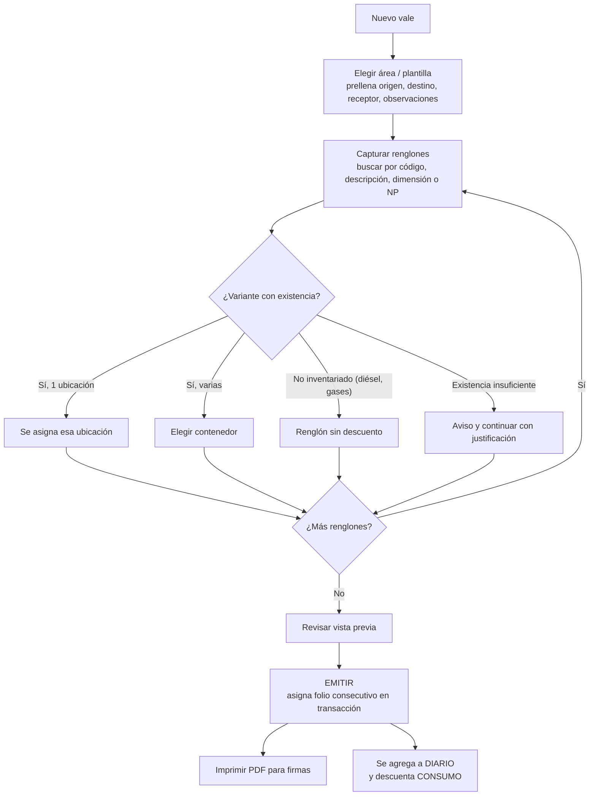
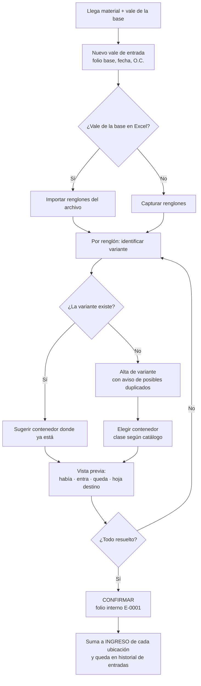

# 05 — Flujos de trabajo

## 1. Vale de salida (consumo o transferencia)

- **Borradores:** se pueden tener varios abiertos en pestañas. No consumen folio y se guardan automáticamente.
- **Emitir** es el único paso que asigna folio. Si otro proceso ya tomó el número, la transacción lo impide y toma el siguiente.
- **Más de 21 renglones:** la herramienta avisa y ofrece dividir en dos vales consecutivos.
- **Transferencias:** la plantilla `TRANSFERENCIAS` exige "Autorizó" y marca la naturaleza como `TRANSFERENCIA`.
- **NOV (diésel):** es una salida normal con renglón no inventariado.

## 2. Vale de entrada (material recibido de la base)

**Así se evita meter material al contenedor equivocado:**
1. Si la variante ya vive en un contenedor, se propone ese.
2. Si vive en varios, se propone el que tiene más existencia.
3. La vista previa muestra el nombre exacto de la hoja del Excel donde quedará.
4. Nada se aplica hasta confirmar, y una entrada confirmada se puede **cancelar** con motivo (revierte el ingreso).

## 3. Corrección, cancelación y devolución

| Caso | Qué hace la herramienta |
|---|---|
| **Error de captura** en un vale emitido | Editar con **motivo obligatorio**. El folio no cambia. La bitácora guarda antes → después y la existencia se recalcula sola. |
| **Vale que no debió emitirse** | Cancelar con motivo. El folio queda como `CANCELADO` (no se reutiliza) y la existencia se revierte. |
| **Devolución de material** | Pendiente de confirmar (P-08). Opción A: corregir el vale original. Opción B: vale de entrada tipo "Devolución" que referencia el folio original. |
| **Vale ya enviado a la base y luego corregido** | Queda marcado; al exportar se muestra la lista "modificados desde el último envío" para avisar a la base. |

## 4. Conteo físico

1. Elegir el alcance: todo o algunos contenedores.
2. (Opcional) Imprimir la hoja de conteo por contenedor, sin cantidades.
3. Capturar lo contado. La herramienta muestra la diferencia contra el teórico (`TOTAL`) antes de aplicar.
4. Aplicar: `CANTIDAD` = contado, y CONSUMO/INGRESO se reinician. El conteo registra el último folio de salida y de entrada incluidos.
5. El conteo anterior queda en el historial.

## 5. Conciliación contra AX

- **Existencia física para comparar:** el `TOTAL` calculado de todas las ubicaciones de esa variante.
- **Vales en tránsito:** los vales (salidas y entradas) posteriores al corte AX. Se usa la fecha de corte o, si se conoce, el último folio aplicado por la base (P-03).
- **Diferencia explicada** = físico − AX + salidas en tránsito − entradas en tránsito. Si da 0, la diferencia se marca como "explicada por vales" y se listan los folios.
- **Valuación:** costo unitario = Valor financiero / Disponible del renglón AX.

## 6. Exportación y envío diario

1. **Exportar → Vales:** genera `VALES DE SALIDA DLTA.xlsm` sobre la plantilla registrada, con `DIARIO` completo y actualizado.
2. La herramienta valida el archivo, lo guarda en la carpeta de exportaciones y registra hasta qué folio se incluyó.
3. El usuario lo envía por correo como hoy y lo marca como "enviado". Esto alimenta el aviso de "modificados desde el último envío".
4. **Exportar → Inventario:** genera el `.xlsx` con fecha en el nombre, cuando se necesite.

## 7. Cambio de guardia

1. El almacenista que sale genera el **resumen de guardia**: vales emitidos, entradas, cancelaciones, pendientes de envío y alertas.
2. El que entra elige su nombre al abrir; desde ese momento los movimientos quedan a su nombre.

## 8. Respaldo y restauración

- Los respaldos automáticos funcionan como se describe en [03-arquitectura.md](03-arquitectura.md#almacenamiento-y-respaldos).
- **Equipo o navegador nuevo:**
  1. Abrir `ControlAlmacen.html` en Edge (no se instala nada).
  2. **Respaldos → Restaurar desde un archivo…** y elegir el `.zip` más reciente de `OneDrive\ControlAlmacen\respaldos`.
  3. La herramienta valida el respaldo (formato, folios únicos, plantillas completas) antes de reemplazar.
  4. Elegir otra vez la carpeta de respaldos; queda lista.
