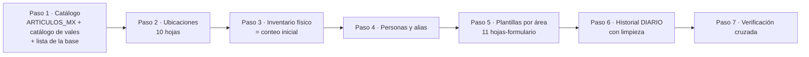

# 07 — Migración y limpieza del historial

## Objetivo

Cargar en la herramienta, sin perder información, lo siguiente:
1. El catálogo.
2. El inventario físico, como **conteo inicial**.
3. El historial completo de vales (`DIARIO`).
4. Las plantillas por área.

Todo se limpia con reglas explícitas y confirmadas por el usuario. **Los archivos originales nunca se modifican.**

## Orden de carga

## Insumo del usuario: lista de revisión

**La genera la propia herramienta** en el paso 2 de la primera carga (formato v2, columnas estructuradas), a partir de los archivos más recientes del usuario. Se guarda en OneDrive, nunca en el repositorio, porque contiene nombres y datos reales. Celdas naranjas = datos perdidos; amarillas = editables. Cifras con los archivos del 28/29-sep-2026:

| Hoja | Qué contiene | Cuántos | Cómo se resuelve |
|---|---|---|---|
| 1 Renglones a corregir | `#REF!`, fechas o cantidades inválidas, descripción que no corresponde al código; cada renglón trae el valor actual o una sugerencia de su folio | 60 (10 alta, 13 media, 37 baja) | El usuario corrige con el PDF; lo que deja igual se aplica como sugerencia |
| 2 Renglones duplicados | Renglones idénticos (vales guardados dos veces) | 47 | Sí/No a eliminar la copia |
| 3 Folios a verificar | Folio 494 faltante, folios 30/297/384 con posible truncamiento o doble guardado, folios con 2 departamentos o fechas raras, destino vacío | 21 | Revisión contra PDF |
| 4 Códigos a confirmar | Códigos fuera del catálogo local (1672, 3358…) y descripciones que no corresponden al código | 24 | Confirmar con la base o corregir |
| 5 Nombres a unificar | 27 grupos de variantes de nombre | 64 | Confirmar el nombre correcto |
| 6 Valores a normalizar | UM, LOTE, departamentos y destinos escritos distinto | 20 | Confirmar el valor propuesto |
| 7 Inventario físico | Renglones repetidos en la misma hoja, el mismo NP con otro código, códigos fuera de catálogo | 70 | Verificación física o de catálogo |

El importador lee este archivo ya contestado y aplica las respuestas. Cada fila se valida contra el DIARIO actual (fila + folio); si ya no corresponde, se ignora con aviso. Las hojas 3 y 7 son informativas.

> La primera versión (v1) que se entregó en el chat era solo para lectura; la v2 generada por la herramienta es la que se contesta.

## Reglas de limpieza del DIARIO

| # | Situación | Regla | ¿Automática? |
|---|---|---|---|
| L-01 | Renglón idéntico repetido en el mismo folio | Se conserva el primero y se elimina la copia | Solo si el usuario dijo **Sí** en la hoja 2 |
| L-02 | Celdas con `#REF!` | Se usa el dato capturado del PDF. En LOTE sin respuesta queda vacío. En encabezados sin respuesta se toma el de los otros renglones del mismo folio. | Semiautomática |
| L-03 | Renglón completamente `#REF!` (fila 1147) | Se elimina, salvo que el PDF del folio 475 muestre un renglón faltante | Según respuesta |
| L-04 | Fecha como texto (`" 11/04/2026"`) | Se convierte a fecha | Automática |
| L-05 | Nombres con variantes | Se reemplazan por el nombre canónico (tabla `persona_alias`) | Según hoja 5 |
| L-06 | UM, LOTE, departamentos, destinos | Mapeo de la hoja 6 | Según hoja 6 |
| L-07 | Descripción con error de dedo y código correcto | Se usa la descripción del catálogo | Automática |
| L-08 | Código fuera de catálogo | Se da de alta el artículo con la descripción del DIARIO, marcado "por confirmar con AX" | Automática + aviso |
| L-09 | Destino `0` | El valor que indique el usuario (propuesta: `RIG 91`) | Según hoja 3 |
| L-10 | Folio faltante (494) | Se captura desde el PDF o se registra como "folio no utilizado", con nota | Según hoja 3 |
| L-11 | Folio con 2 departamentos (358, 495) | Se conserva cada renglón con su encabezado original (se exporta igual); se revisa contra el PDF | Automática |
| L-12 | Pase de salida vacío o 0 en vales antiguos (446 renglones) | Se exporta `XXXXX`: todos los vales del DIARIO son salidas | Automática |
| L-13 | Espacios sobrantes al inicio o final (`PZA `, `MECANICO `) | Se quitan; los espacios **internos** se respetan (AX usa dobles espacios) | Automática |

Cada renglón migrado guarda `fila_diario_origen` para poder rastrear su origen.

## Historial vs. existencias

- Los vales **anteriores al conteo inicial** solo son historial: **no** afectan existencias, porque el conteo físico ya los refleja.
- Los vales **posteriores al conteo inicial** sí descuentan: se vuelven el CONSUMO/INGRESO de cada renglón.
- **Punto de corte:** folio **549** (P-12, confirmado): se descuentan los vales **550 en adelante**. El asistente lo sugiere solo: último folio con fecha anterior a la del conteo.
- Las columnas CONSUMO e INGRESO del archivo **no** se suman como ajuste: se reconstruyen desde los vales posteriores al corte, y el reporte de verificación señala donde no coincidan (por ejemplo, el vale 550 no aparece descontado en el archivo).
- Para vales migrados posteriores al corte, se asigna la ubicación de cada renglón. Si la variante está en una sola ubicación, se asigna automáticamente; si está en varias, el usuario elige en una pantalla de "renglones por ubicar".

## Verificación cruzada (paso 7)

Al terminar, la herramienta muestra un reporte que debe cuadrar al 100%:
- Número de folios y de renglones migrados, eliminados (con motivo) y corregidos.
- Por cada hoja de inventario: suma de CANTIDAD, CONSUMO, INGRESO y TOTAL, contra el archivo original.
- Exportación de prueba: el `DIARIO` exportado reimportado da los mismos datos, y el inventario exportado da los mismos totales por hoja que el original (salvo las limpiezas aprobadas).

## Re-ejecución

La migración se puede correr varias veces sobre una base vacía (modo "ensayo") hasta que el reporte cuadre. Solo entonces se hace la migración definitiva y se toma el primer respaldo.
