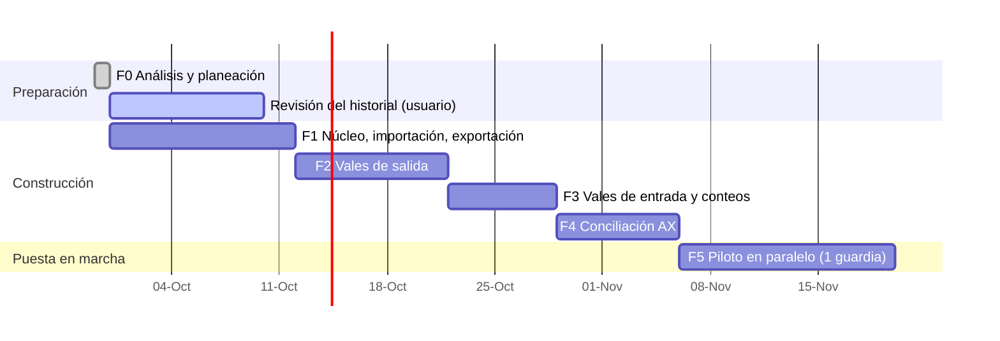

# 08 — Plan de trabajo

Cada fase entrega una **versión nueva de `ControlAlmacen.html`** que el usuario abre en Edge y prueba en su PC (sin instalar nada). No se pasa a la siguiente fase sin que el usuario acepte la anterior.

> Las fechas son orientativas; el avance real depende de las respuestas en [09-pendientes.md](09-pendientes.md).

---

## Fase 0 — Análisis y planeación ✅
- Análisis de los 3 archivos, hallazgos y preguntas.
- Documentación en `docs/`.
- Lista de revisión del historial (`Revision_historial_DLTA.xlsx`, fuera del repositorio).

## Fase 1 — Núcleo de datos, importación y exportación idéntica ✅ (entregada en versión web, en aceptación)
**Objetivo:** demostrar que la herramienta puede leer los archivos actuales y **reproducirlos idénticos**. Es la base de todo lo demás.

La primera entrega fue de escritorio (Python + instalador). Seguridad de Windows bloqueó el instalador (P-20), así que
F1 se rehízo como **herramienta web que guarda los datos en el equipo** ([03-arquitectura.md](03-arquitectura.md)).
La versión web se validó contra la de escritorio con los archivos reales: mismos datos importados, mismo reporte de
verificación y mismos Excel exportados celda por celda.

Entregables:
- `ControlAlmacen.html` (un solo archivo, ~190 KB) con datos en IndexedDB y respaldos `.zip` en la carpeta elegida (OneDrive).
- Importadores: catálogo, inventario físico, DIARIO (con reglas de limpieza y lectura de la lista de revisión v2), plantillas por área.
- Exportadores sobre plantilla: inventario `.xlsx` y vales `.xlsm`.
- Respaldo, retención y restauración; copias internas del navegador.
- Pantallas: asistente de primera carga con ensayo, inventario, historial, pendientes, exportar y respaldos.
- Compilación y pruebas en GitHub Actions (artefacto `ControlAlmacen-html`).

Criterios de aceptación (✔ = verificado por el desarrollo con los archivos reales, fuera del repositorio; ☐ = lo verifica el usuario en su PC):
- ✔ En el `.xlsm` exportado solo cambian 2 partes del ZIP (DIARIO y `workbook.xml`); todas las demás (macros, botones, logos, formularios) quedan idénticas byte por byte, incluso comprimidas. LibreOffice lo abre sin errores.
- ☐ Abrirlo en **Excel** sin mensaje de reparación y comprobar que **GRABAR / LIMPIAR DATOS siguen funcionando**.
- ✔ El `.xlsx` exportado conserva hojas, tablas, fórmulas, notas y filas bajo la tabla; LibreOffice recalcula las 1,258 fórmulas sin errores y los totales por hoja coinciden.
- ✔ El reporte de verificación cuadra en 8 de 10 hojas; las 2 diferencias son los vales 550 y 554 que el Excel aún no descontaba (esperado con corte 549).
- ✔ Un respaldo restaurado en otro navegador produce los mismos datos (prueba automática).
- ☐ Abrir `ControlAlmacen.html` en Edge en la PC del almacén, elegir la carpeta de OneDrive y hacer la primera carga real.

## Fase 2 — Vales de salida
Entregables:
- Formulario dinámico con pestañas (varios borradores), plantillas por área y buscador de variantes con existencia por contenedor.
- Folio automático, validaciones, límite de 21 renglones con división.
- PDF del vale con el formato actual. Se valida con el usuario **antes** de cerrar la fase (prototipo impreso).
- Corrección y cancelación con motivo y bitácora.
- Descuento automático de existencias. Exportación de vales lista para enviar por correo.
- Tablero de inicio (último folio, vales del día, alertas).

Criterios de aceptación:
- [ ] Emitir un vale de 10 renglones en menos de 2 minutos.
- [ ] Es imposible duplicar o saltar un folio (prueba automática de concurrencia).
- [ ] El DIARIO exportado es aceptado por la base sin comentarios (prueba real de un envío).

## Fase 3 — Vales de entrada y conteos
Entregables:
- Vale de entrada con ubicación sugerida, alta de variante y vista previa antes/después.
- Historial y exportación de entradas.
- (El vale de la base llega en papel, P-04: se captura. La lectura por OCR queda como mejora futura.)
- Conteo físico total o parcial, hoja de conteo imprimible y reacomodo entre contenedores.

Criterios de aceptación:
- [ ] Una entrada de material nuevo queda en la hoja/contenedor correcto del Excel exportado.
- [ ] Un conteo parcial reinicia CONSUMO/INGRESO solo en las ubicaciones contadas.

## Fase 4 — Conciliación contra AX
Entregables:
- Importación del reporte AX (completo o filtrado) con historial de cortes.
- Emparejamiento en tres niveles con memoria de equivalencias.
- Vistas por artículo, por contenedor y valuadas, con vales en tránsito.
- Exportación de la solicitud de ajuste (AX + Existencia física + Folios).

Criterios de aceptación:
- [ ] Con el corte de muestra, al menos el 95% de los renglones AX quedan emparejados tras una sola sesión de confirmación, y el segundo corte reutiliza las equivalencias.
- [ ] Cada diferencia muestra los folios que la explican, o se marca como no explicada.

## Fase 5 — Piloto en paralelo y cierre
- Durante **una guardia completa (~14 días)** se trabaja con la herramienta y se siguen enviando los Excel exportados. La base no debe notar diferencia.
- Manual de usuario de 1–2 páginas por flujo (con capturas).
- Ajustes de usabilidad según la experiencia de ambos almacenistas.
- Decisión de adopción completa (a partir de ahí se exporta solo `DIARIO`, RF-64).

---

## Cómo se trabajará en cada fase
1. Rama de trabajo por fase y Pull Request con descripción de cambios.
2. Pruebas automáticas (`node --test`) con Excel **sintéticos** generados por `tests/fixtures/generar.py`. Nunca con datos reales.
3. Al cerrar la fase: `ControlAlmacen.html` nuevo + notas de versión + lista de verificación de aceptación para el usuario.
4. Los datos del usuario pasan de una versión a otra sin hacer nada: se quedan en su navegador (y en sus respaldos).
