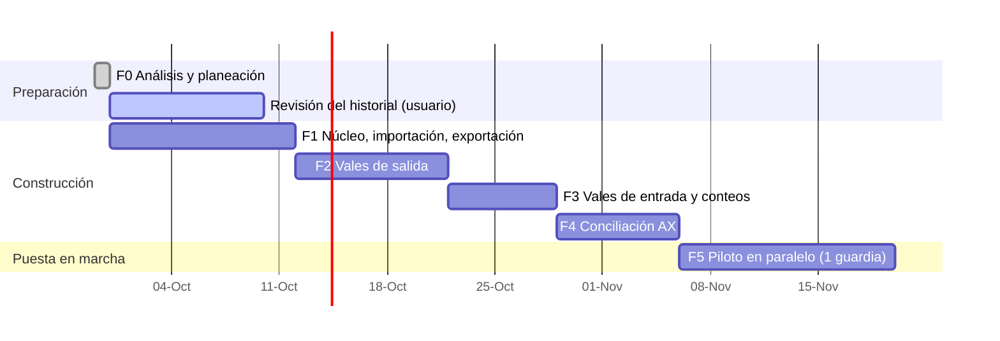

# 08 — Plan de trabajo

Cada fase entrega una **versión nueva de `ControlAlmacen.html`** que el usuario abre en Edge y prueba en su PC (sin instalar nada). No se pasa a la siguiente fase sin que el usuario acepte la anterior.

> Las fechas son orientativas; el avance real depende de las respuestas en [09-pendientes.md](09-pendientes.md).

---

## Fase 0 — Análisis y planeación ✅
- Análisis de los 3 archivos, hallazgos y preguntas.
- Documentación en `docs/`.
- Lista de revisión del historial (`Revision_historial_DLTA.xlsx`, fuera del repositorio).

## Fase 1 — Núcleo de datos, importación y exportación idéntica ✅ (versión web, aceptada)
**Objetivo:** demostrar que la herramienta puede leer los archivos actuales y **reproducirlos idénticos**. Es la base de todo lo demás.

La primera entrega fue de escritorio (Python + instalador). Seguridad de Windows bloqueó el instalador (P-20), así que
F1 se rehízo como **herramienta web que guarda los datos en el equipo** ([03-arquitectura.md](03-arquitectura.md)).
La versión web se validó contra la de escritorio con los archivos reales: mismos datos importados, mismo reporte de
verificación y mismos Excel exportados celda por celda.

Entregables:
- `ControlAlmacen.html` (un solo archivo, ~190 KB en F1; ~300 KB con F2) con datos en IndexedDB y respaldos `.zip` en la carpeta elegida (OneDrive).
- Importadores: catálogo, inventario físico, DIARIO (con reglas de limpieza y lectura de la lista de revisión v2), plantillas por área.
- Exportadores sobre plantilla: inventario `.xlsx` y vales `.xlsm`.
- Respaldo, retención y restauración; copias internas del navegador.
- Pantallas: asistente de primera carga con ensayo, inventario, historial, pendientes, exportar y respaldos.
- Compilación y pruebas en GitHub Actions (artefacto `ControlAlmacen-html`).

Criterios de aceptación (✔ = verificado por el desarrollo con los archivos reales, fuera del repositorio; ☐ = lo verifica el usuario en su PC):
- ✔ En el `.xlsm` exportado solo cambian 2 partes del ZIP (DIARIO y `workbook.xml`); todas las demás (macros, botones, logos, formularios) quedan idénticas byte por byte, incluso comprimidas. LibreOffice lo abre sin errores.
- ✔ Abrirlo en **Excel** y comprobar que **GRABAR / LIMPIAR DATOS siguen funcionando** (confirmado por el usuario).
- ✔ El `.xlsx` exportado conserva hojas, tablas, fórmulas, notas y filas bajo la tabla; LibreOffice recalcula las 1,258 fórmulas sin errores y los totales por hoja coinciden.
- ✔ El reporte de verificación cuadra en 8 de 10 hojas; las 2 diferencias son los vales 550 y 554 que el Excel aún no descontaba (esperado con corte 549).
- ✔ Un respaldo restaurado en otro navegador produce los mismos datos (prueba automática).
- ✔ Abrir `ControlAlmacen.html` en Edge y probar respaldos y restauración (el usuario pidió destacar el respaldo más reciente y hacer más claro el botón *Restaurar*: atendido al inicio de F2).

## Fase 2 — Vales de salida ✅ (aceptada)
Entregables:
- **Nuevo vale** con pestañas (varios borradores que se guardan solos y no gastan folio), plantillas por área y buscador de variantes que muestra la existencia por contenedor.
- Folio automático (último + 1, sin saltos ni cancelaciones) dentro de un cambio atómico; validaciones con mensajes por renglón; justificación cuando se pide más de lo que hay; división en folios consecutivos cuando el vale supera la capacidad del formato (21/20/19 según la hoja).
- **Impresión sobre la hoja-formulario del propio libro de vales** (logo, colores, bordes, anchos, observaciones, firmas, pie de página y escala), tamaño carta, desde el diálogo de Edge (impresora o PDF). Vista previa con `BORRADOR`.
- Detalle del vale con **corrección** (motivo que se llena solo con los cambios, antes → después) en la bitácora. Sin cancelación: todos los folios se usan.
- Descuento automático de existencias. Exportación del DIARIO con los vales nuevos.
- **Por enviar a la base:** lista de vales nuevos o corregidos desde el último envío y botón "Ya lo envié".
- **Traer vales hechos en el Excel** después de la primera carga (así no quedan huecos de folio).
- **Áreas y personas:** edición de plantillas (incluye formato de impresión y lote por defecto), personas, almacenistas y folios.
- Tablero de inicio (siguiente folio, vales de hoy, por enviar, por ubicar, renglones en 0).
- Respaldos: el más reciente se muestra en grande y *Restaurar* es un botón (comentario del usuario sobre F1).

**Ronda de comentarios del usuario (aplicada):** borde derecho del vale impreso igual a los demás; página *Vales de
salida* sin repeticiones de "Nuevo vale" y sin pestañas cuando no hay borradores; datos del vale a la izquierda y
partidas al centro con las columnas del vale; vales internos con origen/destino fijos (`RIG 91 · ALMACEN` → `RIG 91 ·
área`), entregó = almacenista en turno, autorizó solo en transferencias y observaciones fijas donde solo cambia la etapa
de perforación; quién recibe se busca por nombre o puesto; partidas código → clave (filtrada por el código, con
contenedor y existencia en pastillas); borrar partida más claro; contador de partidas en la pestaña; búsqueda rápida
opcional en *Ajustes*; historial con filtros combinables; exportar con ventana "Guardar como".

**Tercera ronda (aplicada):** todas las listas desplegables con el mismo estilo (sin listas nativas del navegador); sin
cancelación ni salto de folios (se quitó "fijar siguiente folio"); motivo de la corrección que se llena solo con los
cambios; Autorizó con puesto y sugerencias RIG MANAGER / ITP; personas mostradas por su puesto (el uso en el área solo
ordena); NOV con datos fijos, 4 firmas y 3 fotos en la posición y tamaño del formato. Pendiente: transferencias (P-22).

**Cuarta ronda (aplicada):** fotos en su propia sección debajo de las partidas; en el panel, origen y destino al
principio (transferencias) y lo que se llena solo al final; encabezado "Presentación" o "U.M." según el espacio. Además,
a propuesta del usuario, *Ajustes → Mi pantalla de vales*: cada almacenista reordena los bloques del panel arrastrándolos
en una vista previa (o con ↑ ↓) y elige de qué lado van los datos y las partidas; se guarda por almacenista. De paso se
corrigió que un cambio hecho menos de un segundo antes de salir de *Vales de salida* no se guardara en el borrador.

Criterios de aceptación (✔ = verificado por el desarrollo; ☐ = lo verifica el usuario):
- ✔ Es imposible duplicar o saltar un folio: prueba automática con 12 emisiones simultáneas y guardado lento (3 con errores que no consumen folio).
- ✔ Recorrido completo en Chromium con los archivos reales (fuera del repositorio): nuevo vale → vista previa → emitir → imprimir → corregir (motivo automático) → dividir → exportar → marcar enviado → traer del Excel → áreas; NOV con 4 firmas y fotos impresas en su lugar; respaldo con fotos; ninguna lista nativa del navegador; sin errores en consola ni conexiones de red.
- ✔ La impresión de las hojas reales se comparó contra el PDF de LibreOffice de la misma hoja: mismo logo, colores, marco, firmas y pie.
- ✔ Imprimir un vale en la impresora del almacén y compararlo con uno hecho en Excel (P-09: el usuario los comparó, "98 % similares").
- ✔ Transferencias: se capturan como están (P-22).
- ☐ Emitir un vale de 10 renglones en menos de 2 minutos.
- ☐ El DIARIO exportado es aceptado por la base sin comentarios (prueba real de un envío).

## Fase 3 — Vales de entrada y conteos ✅ (entregada, en aceptación)
Entregables:
- **Vales de entrada** en pestañas (borradores que se guardan solos): folio de la base, de dónde viene, quién entrega;
  por renglón código → clave con el contenedor sugerido (el de más existencia, ★), "Entra a" para cambiarlo, variante
  nueva con aviso de parecidas, *Sin existencia* para diésel y gases. Vista previa *Así queda el inventario* (había,
  entra, queda, hoja). Folio interno consecutivo `E-0001`; corrección con motivo automático y bitácora; aviso de folio de
  la base repetido. Devoluciones que regresan al renglón de donde salió el material (P-08).
- **Historial** con pestañas Salidas / Entradas (filtros por fecha, folio de la base, código, O.C. y texto) y
  exportación de `VALES DE ENTRADA DLTA.xlsx` (columnas del DIARIO + folio interno).
- **Conteo físico** total o por contenedor: hoja de conteo imprimible a ciegas, captura que se guarda sola, diferencias
  contra el sistema, material encontrado, aviso de vales emitidos durante el conteo, historial de conteos.
- **Mover entre contenedores** desde *Inventario*, con historial.
- Estado formato 5 (se migra solo); cada renglón del inventario descuenta desde su propio conteo.
- (El vale de la base llega en papel, P-04: se captura. La lectura por OCR queda como mejora futura.)

Criterios de aceptación (✔ = verificado por el desarrollo; ☐ = lo verifica el usuario):
- ✔ Una entrada de material nuevo queda en la hoja/contenedor correcto del Excel exportado (prueba automática: al final
  de la tabla de esa hoja, con INGRESO, fórmulas y fila de totales; las demás hojas no cambian; código nuevo en `ARTICULOS_MX`).
- ✔ Un conteo parcial reinicia CONSUMO/INGRESO solo en las ubicaciones contadas (prueba automática y en el inventario exportado).
- ✔ Recorrido en Chromium: entrada con sugerido, variante nueva y sin existencia → corrección → historial → mover →
  conteo parcial y total con material encontrado → devolución → exportaciones → respaldo; datos de la versión anterior
  abiertos con la nueva; sin errores en consola ni conexiones de red.
- ☐ Registrar una entrada real y revisar el inventario exportado.
- ☐ Hacer un conteo (aunque sea de un contenedor) con la hoja impresa.

## Fase 4 — Conciliación contra AX
Entregables:
- Importación del reporte AX (completo o filtrado) con historial de cortes.
- Emparejamiento en tres niveles con memoria de equivalencias.
- Vistas por artículo, por contenedor y valuadas, con vales en tránsito.
- Exportación de la solicitud de ajuste (AX + Existencia física + Folios).

Criterios de aceptación:
- [ ] Con el corte de muestra, al menos el 95% de los renglones AX quedan emparejados tras una sola sesión de confirmación, y el segundo corte reutiliza las equivalencias.
- [ ] Cada diferencia muestra los folios que la explican, o se marca como no explicada.

## Fase 5 — Piloto en paralelo y cierre
- Durante **una guardia completa (~14 días)** se trabaja con la herramienta y se siguen enviando los Excel exportados. La base no debe notar diferencia.
- Manual de usuario de 1–2 páginas por flujo (con capturas).
- Ajustes de usabilidad según la experiencia de ambos almacenistas.
- Decisión de adopción completa (a partir de ahí se exporta solo `DIARIO`, RF-64).

---

## Cómo se trabajará en cada fase
1. Rama de trabajo por fase y Pull Request con descripción de cambios.
2. Pruebas automáticas (`node --test`) con Excel **sintéticos** generados por `tests/fixtures/generar.py`. Nunca con datos reales.
3. Al cerrar la fase: `ControlAlmacen.html` nuevo + notas de versión + lista de verificación de aceptación para el usuario.
4. Los datos del usuario pasan de una versión a otra sin hacer nada: se quedan en su navegador (y en sus respaldos).
