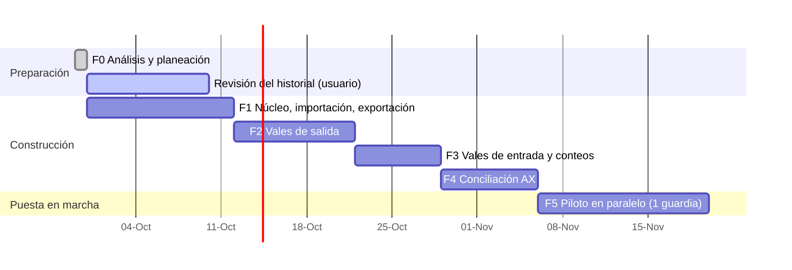

# 08 — Plan de trabajo

Cada fase entrega un **instalador `.exe` funcional** que el usuario puede probar en su PC. No se pasa a la siguiente fase sin que el usuario acepte la anterior.

> Las fechas son orientativas; el avance real depende de las respuestas en [09-pendientes.md](09-pendientes.md).

---

## Fase 0 — Análisis y planeación ✅
- Análisis de los 3 archivos, hallazgos y preguntas.
- Documentación en `docs/`.
- Lista de revisión del historial (`Revision_historial_DLTA.xlsx`, fuera del repositorio).

## Fase 1 — Núcleo de datos, importación y exportación idéntica
**Objetivo:** demostrar que la herramienta puede leer los archivos actuales y **reproducirlos idénticos**. Es la base de todo lo demás.

Entregables:
- Proyecto Python con base de datos SQLite, migraciones, configuración y logs.
- Importadores: catálogo, inventario físico, DIARIO (con reglas de limpieza y lectura de `Revision_historial_DLTA.xlsx`), plantillas por área.
- Exportadores sobre plantilla: inventario `.xlsx` y vales `.xlsm`.
- Respaldo y restauración en OneDrive.
- Pantallas mínimas: asistente de migración, consulta de inventario (buscador) y consulta del historial.
- Primer instalador `.exe` (PyInstaller + Inno Setup).

Criterios de aceptación:
- [ ] El `.xlsm` exportado abre en Excel sin reparación, conserva logos y botones, y **GRABAR / LIMPIAR DATOS siguen funcionando**.
- [ ] El `.xlsx` exportado tiene las mismas hojas, tablas, fórmulas, notas y totales por hoja que el original (salvo limpiezas aprobadas).
- [ ] El reporte de verificación cruzada de la migración cuadra al 100%.
- [ ] Un respaldo restaurado en otra carpeta produce exactamente los mismos datos.

## Fase 2 — Vales de salida
Entregables:
- Formulario dinámico con pestañas (varios borradores), plantillas por área y buscador de variantes con existencia por contenedor.
- Folio automático, validaciones, límite de 21 renglones con división.
- PDF del vale con el formato actual. Se valida con el usuario **antes** de cerrar la fase (prototipo impreso).
- Corrección y cancelación con motivo y bitácora.
- Descuento automático de existencias. Exportación de vales lista para enviar por correo.
- Tablero de inicio (último folio, vales del día, alertas).

Criterios de aceptación:
- [ ] Emitir un vale de 10 renglones en menos de 2 minutos.
- [ ] Es imposible duplicar o saltar un folio (prueba automática de concurrencia).
- [ ] El DIARIO exportado es aceptado por la base sin comentarios (prueba real de un envío).

## Fase 3 — Vales de entrada y conteos
Entregables:
- Vale de entrada con ubicación sugerida, alta de variante y vista previa antes/después.
- Historial y exportación de entradas.
- Importación del vale de la base en Excel (si aplica, P-04).
- Conteo físico total o parcial, hoja de conteo imprimible y reacomodo entre contenedores.

Criterios de aceptación:
- [ ] Una entrada de material nuevo queda en la hoja/contenedor correcto del Excel exportado.
- [ ] Un conteo parcial reinicia CONSUMO/INGRESO solo en las ubicaciones contadas.

## Fase 4 — Conciliación contra AX
Entregables:
- Importación del reporte AX (completo o filtrado) con historial de cortes.
- Emparejamiento en tres niveles con memoria de equivalencias.
- Vistas por artículo, por contenedor y valuadas, con vales en tránsito.
- Exportación de la solicitud de ajuste (AX + Existencia física + Folios).

Criterios de aceptación:
- [ ] Con el corte de muestra, al menos el 95% de los renglones AX quedan emparejados tras una sola sesión de confirmación, y el segundo corte reutiliza las equivalencias.
- [ ] Cada diferencia muestra los folios que la explican, o se marca como no explicada.

## Fase 5 — Piloto en paralelo y cierre
- Durante **una guardia completa (~14 días)** se trabaja con la herramienta y se siguen enviando los Excel exportados. La base no debe notar diferencia.
- Manual de usuario de 1–2 páginas por flujo (con capturas).
- Ajustes de usabilidad según la experiencia de ambos almacenistas.
- Decisión de adopción completa (a partir de ahí se exporta solo `DIARIO`, RF-64).

---

## Cómo se trabajará en cada fase
1. Rama de trabajo por fase y Pull Request con descripción de cambios.
2. Pruebas automáticas (pytest) con Excel **anonimizados** en `tests/fixtures/`. Nunca con datos reales.
3. Al cerrar la fase: instalador `.exe` + notas de versión + lista de verificación de aceptación para el usuario.
