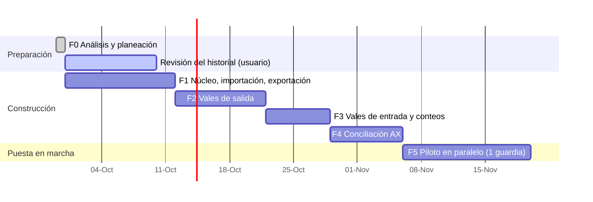

# 08 — Plan de trabajo

Cada fase entrega una **versión nueva de `ControlAlmacen.html`** que el usuario abre en Edge y prueba en su PC (sin instalar nada). No se pasa a la siguiente fase sin que el usuario acepte la anterior.

> Las fechas son orientativas; el avance real depende de las respuestas en [09-pendientes.md](09-pendientes.md).

---

## Fase 0 — Análisis y planeación ✅
- Análisis de los 3 archivos, hallazgos y preguntas.
- Documentación en `docs/`.
- Lista de revisión del historial (`Revision_historial_DLTA.xlsx`, fuera del repositorio).

## Fase 1 — Núcleo de datos, importación y exportación idéntica ✅ (versión web, aceptada)
**Objetivo:** demostrar que la herramienta puede leer los archivos actuales y **reproducirlos idénticos**. Es la base de todo lo demás.

La primera entrega fue de escritorio (Python + instalador). Seguridad de Windows bloqueó el instalador (P-20), así que
F1 se rehízo como **herramienta web que guarda los datos en el equipo** ([03-arquitectura.md](03-arquitectura.md)).
La versión web se validó contra la de escritorio con los archivos reales: mismos datos importados, mismo reporte de
verificación y mismos Excel exportados celda por celda.

Entregables:
- `ControlAlmacen.html` (un solo archivo, ~190 KB en F1; ~300 KB con F2) con datos en IndexedDB y respaldos `.zip` en la carpeta elegida (OneDrive).
- Importadores: catálogo, inventario físico, DIARIO (con reglas de limpieza y lectura de la lista de revisión v2), plantillas por área.
- Exportadores sobre plantilla: inventario `.xlsx` y vales `.xlsm`.
- Respaldo, retención y restauración; copias internas del navegador.
- Pantallas: asistente de primera carga con ensayo, inventario, historial, pendientes, exportar y respaldos.
- Compilación y pruebas en GitHub Actions (artefacto `ControlAlmacen-html`).

Criterios de aceptación (✔ = verificado por el desarrollo con los archivos reales, fuera del repositorio; ☐ = lo verifica el usuario en su PC):
- ✔ En el `.xlsm` exportado solo cambian 2 partes del ZIP (DIARIO y `workbook.xml`); todas las demás (macros, botones, logos, formularios) quedan idénticas byte por byte, incluso comprimidas. LibreOffice lo abre sin errores.
- ✔ Abrirlo en **Excel** y comprobar que **GRABAR / LIMPIAR DATOS siguen funcionando** (confirmado por el usuario).
- ✔ El `.xlsx` exportado conserva hojas, tablas, fórmulas, notas y filas bajo la tabla; LibreOffice recalcula las 1,258 fórmulas sin errores y los totales por hoja coinciden.
- ✔ El reporte de verificación cuadra en 8 de 10 hojas; las 2 diferencias son los vales 550 y 554 que el Excel aún no descontaba (esperado con corte 549).
- ✔ Un respaldo restaurado en otro navegador produce los mismos datos (prueba automática).
- ✔ Abrir `ControlAlmacen.html` en Edge y probar respaldos y restauración (el usuario pidió destacar el respaldo más reciente y hacer más claro el botón *Restaurar*: atendido al inicio de F2).

## Fase 2 — Vales de salida ✅ (aceptada)
Entregables:
- **Nuevo vale** con pestañas (varios borradores que se guardan solos y no gastan folio), plantillas por área y buscador de variantes que muestra la existencia por contenedor.
- Folio automático (último + 1, sin saltos ni cancelaciones) dentro de un cambio atómico; validaciones con mensajes por renglón; justificación cuando se pide más de lo que hay; división en folios consecutivos cuando el vale supera la capacidad del formato (21/20/19 según la hoja).
- **Impresión sobre la hoja-formulario del propio libro de vales** (logo, colores, bordes, anchos, observaciones, firmas, pie de página y escala), tamaño carta, desde el diálogo de Edge (impresora o PDF). Vista previa con `BORRADOR`.
- Detalle del vale con **corrección** (motivo que se llena solo con los cambios, antes → después) en la bitácora. Sin cancelación: todos los folios se usan.
- Descuento automático de existencias. Exportación del DIARIO con los vales nuevos.
- **Por enviar a la base:** lista de vales nuevos o corregidos desde el último envío y botón "Ya lo envié".
- **Traer vales hechos en el Excel** después de la primera carga (así no quedan huecos de folio).
- **Áreas y personas:** edición de plantillas (incluye formato de impresión y lote por defecto), personas, almacenistas y folios.
- Tablero de inicio (siguiente folio, vales de hoy, por enviar, por ubicar, renglones en 0).
- Respaldos: el más reciente se muestra en grande y *Restaurar* es un botón (comentario del usuario sobre F1).

**Ronda de comentarios del usuario (aplicada):** borde derecho del vale impreso igual a los demás; página *Vales de
salida* sin repeticiones de "Nuevo vale" y sin pestañas cuando no hay borradores; datos del vale a la izquierda y
partidas al centro con las columnas del vale; vales internos con origen/destino fijos (`RIG 91 · ALMACEN` → `RIG 91 ·
área`), entregó = almacenista en turno, autorizó solo en transferencias y observaciones fijas donde solo cambia la etapa
de perforación; quién recibe se busca por nombre o puesto; partidas código → clave (filtrada por el código, con
contenedor y existencia en pastillas); borrar partida más claro; contador de partidas en la pestaña; búsqueda rápida
opcional en *Ajustes*; historial con filtros combinables; exportar con ventana "Guardar como".

**Tercera ronda (aplicada):** todas las listas desplegables con el mismo estilo (sin listas nativas del navegador); sin
cancelación ni salto de folios (se quitó "fijar siguiente folio"); motivo de la corrección que se llena solo con los
cambios; Autorizó con puesto y sugerencias RIG MANAGER / ITP; personas mostradas por su puesto (el uso en el área solo
ordena); NOV con datos fijos, 4 firmas y 3 fotos en la posición y tamaño del formato. Pendiente: transferencias (P-22).

**Cuarta ronda (aplicada):** fotos en su propia sección debajo de las partidas; en el panel, origen y destino al
principio (transferencias) y lo que se llena solo al final; encabezado "Presentación" o "U.M." según el espacio. Además,
a propuesta del usuario, *Ajustes → Mi pantalla de vales*: cada almacenista reordena los bloques del panel arrastrándolos
en una vista previa (o con ↑ ↓) y elige de qué lado van los datos y las partidas; se guarda por almacenista. De paso se
corrigió que un cambio hecho menos de un segundo antes de salir de *Vales de salida* no se guardara en el borrador.

Criterios de aceptación (✔ = verificado por el desarrollo; ☐ = lo verifica el usuario):
- ✔ Es imposible duplicar o saltar un folio: prueba automática con 12 emisiones simultáneas y guardado lento (3 con errores que no consumen folio).
- ✔ Recorrido completo en Chromium con los archivos reales (fuera del repositorio): nuevo vale → vista previa → emitir → imprimir → corregir (motivo automático) → dividir → exportar → marcar enviado → traer del Excel → áreas; NOV con 4 firmas y fotos impresas en su lugar; respaldo con fotos; ninguna lista nativa del navegador; sin errores en consola ni conexiones de red.
- ✔ La impresión de las hojas reales se comparó contra el PDF de LibreOffice de la misma hoja: mismo logo, colores, marco, firmas y pie.
- ✔ Imprimir un vale en la impresora del almacén y compararlo con uno hecho en Excel (P-09: el usuario los comparó, "98 % similares").
- ✔ Transferencias: se capturan como están (P-22).
- ☐ Emitir un vale de 10 renglones en menos de 2 minutos.
- ☐ El DIARIO exportado es aceptado por la base sin comentarios (prueba real de un envío).

## Fase 3 — Vales de entrada y conteos ✅ (entregada, en aceptación)

**Ronda de comentarios (aplicada, ronda 5):** descartar un borrador ofrece *Deshacer*; la clave es la dimensión tal cual
y el NP va en el LOTE; en entradas se dice "partida", sin motivo ni depto. origen (solo "viene de"); hoja de conteo con
renglones altos y uniformes para escribir; captura desde foto/PDF con Copilot (copiar instrucciones y pegar el JSON) en
entradas y conteo; reporte diario con imágenes PNG de los vales del día, PDF, libro de vales y *Subir al SharePoint* con
botón de completado; menú corto con íconos y ventana *Ajustes y más*; inicio tipo bento con accesos grandes.

**Ronda 6 (aplicada):** el **reporte diario** entrega el libro de vales y el inventario **al cierre del día elegido**
(no imágenes; se quitó el PNG) y *Ya lo subí* marca solo hasta ese folio; **vales de entrada** rediseñados: elegir
*Captura manual* o *Desde foto o PDF* (guía de 3 pasos, se carga al pegar, el JSON roto se repara solo), barra fija
con *Registrar* / *Descartar* y los pendientes, partidas en tarjetas de dos líneas con *Entra a* y *hay → queda*, sin el
subrenglón de "variante nueva" (la clave escrita es la dimensión), y **Solicita** por partida (LOTE, también en el
JSON de Copilot); **Ajustes y más** como vista en primer plano (secciones | contenido, se cierra con clic fuera, ✕ o
Esc); **personalización** por almacenista: tema claro/oscuro/como Windows, avisos arriba o abajo y animaciones;
animaciones suaves y hover discreto en el inicio.

**Ronda 7 (aplicada):** *Ajustes y más* casi a pantalla completa (la vista previa de *Mi pantalla de vales* ya cabe y,
si la ventana es angosta, las partidas pasan abajo); en el inicio, el bento de *Inventario* cambia por **Etapa de
perforación** (se ve y se cambia ahí), *Crear un vale* oscurece su propio azul al pasar el mouse y *Crear reporte
diario* ya no lleva fecha: el **Reporte diario** queda en el menú después de *Conteo físico*; en el reporte, cada
archivo dice **Descargar** y muestra *✓ Descargado* con el nombre del archivo.

**Ronda 8 (aplicada):** en vales de entrada, campo **NP** por partida (y el NP que venga dentro de la clave se pasa
solo a su campo); los indicadores de la barra (*pendientes*, *por revisar*, *con clave nueva*) **filtran** las partidas
que requieren atención; captura con Copilot con botón **Pegar** y transición suave (*✓ Listo* → partidas que entran una
tras otra). En *Áreas y personas*, **unificar nombres repetidos** (sugeridos o marcados a mano) sin tocar los vales.

Entregables:
- **Vales de entrada** en pestañas (borradores que se guardan solos): folio de la base, de dónde viene, quién entrega;
  por renglón código → clave con el contenedor sugerido (el de más existencia, ★), "Entra a" para cambiarlo, variante
  nueva con aviso de parecidas, *Sin existencia* para diésel y gases. Vista previa por partida (había,
  entra, queda, hoja). Folio interno consecutivo `E-0001`; corrección con motivo automático y bitácora; aviso de folio de
  la base repetido. Devoluciones que regresan al renglón de donde salió el material (P-08).
- **Historial** con pestañas Salidas / Entradas (filtros por fecha, folio de la base, código, O.C. y texto) y
  exportación de `VALES DE ENTRADA DLTA.xlsx` (columnas del DIARIO + folio interno).
- **Conteo físico** total o por contenedor: hoja de conteo imprimible a ciegas, captura que se guarda sola, diferencias
  contra el sistema, material encontrado, aviso de vales emitidos durante el conteo, historial de conteos.
- **Mover entre contenedores** desde *Inventario*, con historial.
- Estado formato 5 (se migra solo); cada renglón del inventario descuenta desde su propio conteo.
- (El vale de la base llega en papel, P-04: se captura. La lectura por OCR queda como mejora futura.)

Criterios de aceptación (✔ = verificado por el desarrollo; ☐ = lo verifica el usuario):
- ✔ Una entrada de material nuevo queda en la hoja/contenedor correcto del Excel exportado (prueba automática: al final
  de la tabla de esa hoja, con INGRESO, fórmulas y fila de totales; las demás hojas no cambian; código nuevo en `ARTICULOS_MX`).
- ✔ Un conteo parcial reinicia CONSUMO/INGRESO solo en las ubicaciones contadas (prueba automática y en el inventario exportado).
- ✔ Recorrido en Chromium: entrada con sugerido, variante nueva y sin existencia → corrección → historial → mover →
  conteo parcial y total con material encontrado → devolución → exportaciones → respaldo; datos de la versión anterior
  abiertos con la nueva; sin errores en consola ni conexiones de red.
- ☐ Registrar una entrada real y revisar el inventario exportado.
- ☐ Hacer un conteo (aunque sea de un contenedor) con la hoja impresa.

## Fase 4 — Conciliación contra AX ✅ (entregada, en aceptación)
Entregables:
- Importación del reporte AX (completo o filtrado) con historial de cortes.
- Emparejamiento en tres niveles con memoria de equivalencias.
- Vistas por artículo, por contenedor y valuadas, con vales en tránsito.
- Exportación de la solicitud de ajuste (AX + Existencia física + Folios).

**Ronda 9 (aplicada):** solo se concilia el modelo **INV**; *Por confirmar* **corrige la dimensión / NP del
inventario** a como está en AX (con *Deshacer*), sin memoria aparte; la página es un **bento (masonry)** cuyos mosaicos
abren cada sección en una ventana en primer plano con buscador; la solicitud de ajuste lleva columna *Estado* y la fila
coloreada. Además: fecha del encabezado de página del inventario = día del reporte, descarga más robusta (reintenta,
verifica y, si no se puede escribir donde se eligió, descarga a *Descargas* con el motivo), ▶ del reporte llega a hoy,
**Alt + N** agrega una partida en vales de salida y de entrada, el botón *Copilot* se oculta durante la guía, editar
dimensión y NP desde *Inventario* (con sugerencias de AX), "partida" en lugar de "renglón" en la interfaz y bentos con
acomodo masonry.

**Ronda 10 (aplicada):** en AX **Tamaño + Color = la dimensión** (AX no trae NP): la corrección y las sugerencias ya no
mandan el Color al NP; la **solicitud de ajuste** va primero y destacada (con cuántas partidas lleva); el reporte diario
ya no encima sus secciones; el botón *Quitar* de los vales de salida se colorea completo; revisión general (contraste en
tema oscuro, foco visible, menú en una línea, filtros del historial, pestañas "Borrador N"); y *Ayuda → Abrirla como
aplicación* (acceso directo de Edge en ventana propia).

**Ronda 11 (aplicada):** en *Por confirmar*, las partidas del inventario que ya son pareja de otra partida de AX no se
sugieren ni aparecen en *Otra…* (antes se podía asignar la misma a varias); se avisa cuántas se ocultan y, si no queda
ninguna libre, se propone *No está en el físico*.

**Ronda 12 (aplicada):** el **archivo de vales de la base** (su copia del DIARIO con INV/NINV, TIPO DE MOV, CANTIDAD
aplicada, TR, IN y COMENTARIOS) se importa en *Conciliación AX*: cada partida de los vales sabe si ya está en AX (folio
IN / TR), si está pendiente (INV sin folio, o lo que falta de una aplicación parcial) o si no se descuenta (NO INV,
CONPROV). Lo pendiente cuenta como tránsito aunque el vale sea anterior al corte; NO INV no justifica diferencias. Avisos
de diferencias entre la base y los vales; aviso cuando la base y AX son de días distintos (se usaba el archivo de fecha más
cercana; la Ronda 13 lo simplificó). Columna *AX* y filtro *Revisar* en el historial y en el detalle del vale. **Partidas
duplicadas** dentro de un vale (el formulario de Excel guardaba el vale dos veces): se marcan, se filtran y se quitan
con una corrección con el motivo escrito. Estado formato 7 (`seguimientos_base`).

**Ronda 13 (aplicada):** la **fecha del archivo de la base ya no importa** (no se pide; se guarda solo el último): lo
que no tiene folio IN / TR justifica faltantes aunque el vale sea anterior al corte (también lo sin revisar, lo que la
base no tiene y los vales posteriores a su archivo); la fecha que importa es la del reporte de AX. **Vista *Todos* =
kardex completo** (antes faltaban las partidas por confirmar y las que no están en el físico): mosaico *Todo el reporte
de AX*, filtro *Por confirmar* con *Confirmar…* y casilla para incluir lo que solo está en el físico.

**Ronda 14 (aplicada):** **justificar faltantes con vales**: a cada faltante se le asignan los vales que ya salieron y
que AX aún no descuenta (sin IN / TR), sin importar su fecha; se sugieren por código, dimensión y cantidad y se aprueban
una por una o todas, o se eligen a mano (con *Deshacer* y *Quitar*). La solicitud de ajuste trae ahora la hoja **LEYENDA**
al principio (colores, (S) = salida, (E) = entrada, marcas de los folios), la hoja de AX igual y **VALES POR APLICAR**
para que la base registre esas partidas; las entradas se citan con el **folio del vale de la base**. La pantalla se
reorganizó: bento con lo que se hace (*Enviar a la base*, *Por resolver*: emparejar y justificar, *Diferencias contra AX*,
*Reporte AX*, *Consumos de la base*) y una columna de *Resumen* que solo informa. Estado formato 8 (`corte.asignaciones`).

**Ronda 15 (aplicada):** **partidas de AX sin dimensión** (Tamaño y Color vacíos): se comparan contra todas las
variantes del código que tampoco tienen dimensión (S/D, SIN DIMENSIÓN, S/N… con distintos NP), o contra el código
completo si es su única partida en AX. Antes emparejaba con una sola variante (por ejemplo la que tenía 0) y el resto
quedaba "solo en el físico". La fila muestra "Todo el código (N variantes)" o "Sin dimensión (N variantes)" con lo que
hay en cada una; en AX se lee *SIN DIMENSIÓN*.

**Ronda 16 (aplicada):** **inventario diario**: CONSUMO e INGRESO se "limpian" al pasar el día, como en el Excel del
almacén. La página *Inventario*, el inventario exportado y el del reporte diario muestran CANTIDAD = lo que había al
empezar el día y CONSUMO / INGRESO = solo los vales de ese día (antes se acumulaban desde el conteo, por eso un consumo
de días atrás seguía apareciendo). El TOTAL y lo guardado no cambian.

**Ronda 17 (aplicada):** **dos inventarios, DLTA y GSM, por separado** (mismos tipos de archivo: vales de salida,
inventario, reporte de AX y archivo de la base). Selector en la cabecera con un color por inventario; cada uno con su base
en el navegador, folios, plantillas, respaldos (`almacen_GSM_…` para GSM), carpeta, reporte diario y conciliación; formato
9 (`config.inventario`). Nombres con el inventario: `VALES DE ENTRADA GSM.xlsx`, `SOLICITUD DE AJUSTE RIG 91 GSM
DDMMAA.xlsx`. Aviso al elegir un archivo cuyo nombre dice el otro inventario; un respaldo no se restaura en el otro.
**Vale impreso por inventario** (*Ajustes*): se imprime con los textos y logos del libro de vales cargado; el encabezado
del archivo aparece editable (p. ej. el nombre del almacén «MX DLTA …» y la dirección para GSM), reemplazos en todo el
formato y cambio de logos, con vista previa por hoja. No cambia el Excel ni los vales.
- ☐ Hacer la primera carga de GSM con sus archivos y revisar que DLTA sigue igual.

**Ronda 18 (aplicada):** en GSM **toda la interfaz** toma el morado (botones, enlaces, menú, pestañas, foco; claro y
oscuro). **Etapa de perforación compartida** entre DLTA y GSM (base común; se adopta al abrir, cargar o restaurar).
*Vale impreso*: dice que los textos y logos valen para todas las hojas. **Vale impreso más fiel:** bordes negros nítidos
con su grosor (1 px fino, 2 px el marco) y sin rendijas entre celdas de color al escalar la hoja; «RECIBIO/ENTREGO» centrado
sobre el nombre y el puesto (en el formato era una celda suelta alineada a la izquierda); las filas espaciadoras no
imprimen su texto.
- ☐ Imprimir un vale y revisar bordes y títulos de firma contra el de papel.
- ☐ Revisar el vale impreso de GSM (textos y logo) contra uno en papel.

Hecho: página *Conciliación AX* (menú, después de *Reporte diario*): importar el corte con vista previa (almacén, fecha
del nombre, folio de corte opcional, aviso si el archivo ya se importó); resumen (emparejado %, cuadran, sin explicar
con valor, solicitud de ajuste); *Por confirmar* con *Es esta* / otra / *No está en el físico* y *Confirmar las seguras*;
vistas por renglón de AX, por artículo, por contenedor y valuada con filtros; listas sin pareja; exportación
`SOLICITUD DE AJUSTE RIG 91 DDMMAA.xlsx`. Estado formato 6 (`cortes_ax`, `equivalencias_ax`).

Criterios de aceptación (✔ = verificado por el desarrollo; ☐ = lo verifica el usuario):
- ✔ Con el corte sintético, 92 % queda emparejado solo; tras una sesión de confirmación (que corrige el inventario), 100 %, y el segundo corte empareja exacto sin preguntar (prueba automática).
- ✔ Cada diferencia muestra los folios que la explican (salidas y entradas en tránsito), o queda como sobrante / faltante sin explicar con su valor (prueba automática y en pantalla).
- ☐ Con el corte real (`DELTA RIG 91 <fecha>.xlsx`): al menos 95 % emparejado tras una sesión de confirmación.
- ☐ Revisar con la base que la solicitud de ajuste se entienda igual que el reporte de AX.
- ✔ Con el archivo de la base sintético, cada partida queda aplicada / parcial / pendiente / NO INV / sin revisar como
  dice la base, lo pendiente explica diferencias como tránsito y las duplicadas se quitan con una corrección (pruebas
  automáticas y en pantalla).
- ✔ La vista *Todos* trae cada partida INV del reporte de AX (también por confirmar y sin físico) y cada mosaico cuenta
  lo mismo que su filtro (prueba automática y en pantalla).
- ☐ Importar un archivo de la base con todos los vales hasta la fecha del reporte de AX y revisar los avisos y las duplicadas.
- ✔ Un faltante se justifica asignándole vales (sugeridos y aprobados, o a mano); lo asignado explica la diferencia y sale
  en *VALES POR APLICAR*; la solicitud abre con su *LEYENDA* (pruebas automáticas y en pantalla).
- ☐ Revisar con la base que *VALES POR APLICAR* y la *LEYENDA* se entiendan.

## Fase 5 — Piloto en paralelo y cierre
- Durante **una guardia completa (~14 días)** se trabaja con la herramienta y se siguen enviando los Excel exportados. La base no debe notar diferencia.
- Manual de usuario de 1–2 páginas por flujo (con capturas).
- Ajustes de usabilidad según la experiencia de ambos almacenistas.
- Decisión de adopción completa (a partir de ahí se exporta solo `DIARIO`, RF-64).

---

## Cómo se trabajará en cada fase
1. Rama de trabajo por fase y Pull Request con descripción de cambios.
2. Pruebas automáticas (`node --test`) con Excel **sintéticos** generados por `tests/fixtures/generar.py`. Nunca con datos reales.
3. Al cerrar la fase: `ControlAlmacen.html` nuevo + notas de versión + lista de verificación de aceptación para el usuario.
4. Los datos del usuario pasan de una versión a otra sin hacer nada: se quedan en su navegador (y en sus respaldos).
